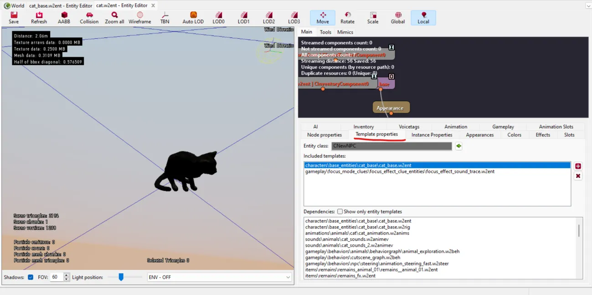
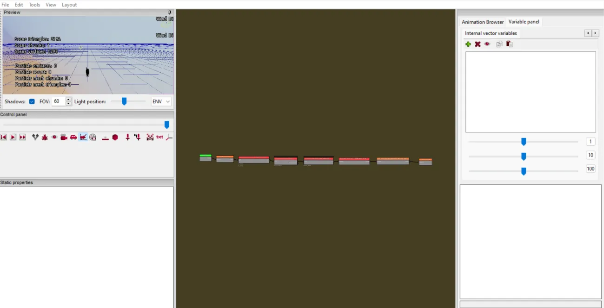
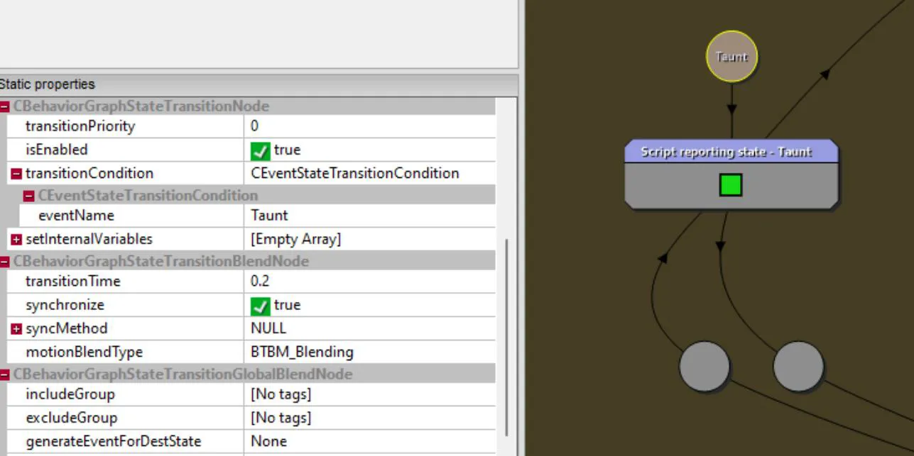

---
tags:
  - Basics
  - General Information
  - Behavior
  - w2behtree
  - w2beh
---
# General Overview of the Behavior System

## Behavior (Using the Hissing Cat as an Example)

When encountering the player, cats in the game start hissing. 
This standard AI behavior is defined in the complex "behavior" system.

To understand the general structure of how behaviors work, you need to go through a bit of an investigative journey.

First, let’s open the cat template and look at the main settings in the "**Template Properties**" tab.



Here, we’ll see a reference to the base template applied to this cat.

This hierarchy is necessary if we want to create other cat templates while preserving their base behaviors and properties.

So, the behavior of any cat is determined by its base template:

`"characters\base_entities\cat_base\cat_base.w2ent"`

After opening the template, go to the "**AI**" tab and the "**AI Tree**" sub-tab. 
This is where the behavior templates for our cat are defined.

It’s important to note that cats are animals, and many behavior parameters will be the same for other animals. 
That’s why the editor immediately offers a selection of several base behavior templates in the top combo box. 
By choosing a template, you define the set of parameters that need to be configured for a specific NPC. 
Base templates are defined in script files and are based on special behavior trees, which we’ll explore later.

To understand what makes the cat hiss when it sees the player, we look for settings that logically fit this action.

There, we’ll find the following parameters (see screenshot):


The `reactionTree` collection contains several different reactions to external stimuli. The reaction we’re interested in looks like this:


Having identified the reaction responsible for behavior in the presence of the player, we now look for information about it in the scripts.


```ws hl_lines="12"
class CAIActionTauntAndMoveOut extends CAIMonsterActionSubtree
{	
	default reactionPriority 		= 20;
	default actionEventName 		= 'PlayerPresenceAction';
	default actionCooldownDistance 	= 2;
	default actionCooldownTimeout 	= 1;
		
	default disallowOutsideOfGuardArea 			= true;
	default forwardAvailabilityToReactionTree 	= true;
	function Init()
	{
		reactionLogicTree = new CAINpcReactionTauntAndMoveOut in this;
		reactionLogicTree.OnCreated();		
	}
};
```
Essentially, this class describes the default parameter values for this type of reaction.
What interests us is the parameter set as a logic tree for this reaction.

```ws linenums="1"
class CAINpcReactionTauntAndMoveOut extends CAINpcReaction
{	
	default aiTreeName = "gameplay\trees\reactions\reaction_taunt_and_move_out.w2behtree";
};
```

fter finding this class, we see what we were looking for: 
a reference to the file that defines the behavior in the described situation.

Trees in `w2behtree` files require separate study, as they are a fairly complex system. 
However, in 99% of cases, you won’t need to edit or create new ones. 
Most tasks can be solved using existing trees.

You’ll only need to write a new tree when creating a completely new game mechanic that affects all NPCs.

But let’s get back to the hissing cat. The tree we found, among other actions, 
generates an animation event called "**Taunt**," which makes the cat hiss.


### The Visual Part of Behavior
Now, let’s figure out how this manifests visually.

We’ve determined that the cat has a parameter for reacting to the player’s presence. 
Some (currently unclear) scripts trigger this event for all nearby NPCs, activating the behavior tree files 
that describe how to react.
All of this happens in the "brain" (logic), but what about the visual expression?

This is where the second part of behaviors comes in – the visual part.

Let’s return to the base cat and go to the "**Animation**" tab, specifically the "**Behaviors**" sub-tab. 
Here, all animations for all possible situations of the current NPC are defined.

Specifically, the cat has two types of behavior animations: regular and for cutscenes. 
Since cats are background and fairly simple NPCs, they don’t even have 
their own separate visual behavior file. 
They use a shared template for all animals.


Now, let’s go to this file.

By default, the editor will be empty because no entity is loaded for which we want to build the logic.

To load the cat into the editor:

1. Select its entity in the resource browser (the regular one, not the base one).
2. In the behavior editor, in the top-left corner (black screen), right-click.
3. Select "**Use selected entity**."

The cat will appear in the preview window, and the behavior graph will appear in the center.

This graph resembles the quest editor’s graph but has a strange logic structure.

For example: All lines go from right to left, and the entry into the graph happens from the inside, not the outside.

Thus, what you see at first glance is the end of the logic, not its beginning.



To navigate to the starting points of the logic, you’ll need to double-click on blocks containing logic. 
Unfortunately, such blocks aren’t clearly marked, so try clicking on everything you can. 
At the very least, blocks labeled "**State machine**" definitely have nested content.

While wandering through the inner blocks, you’ll come across a screen like this:


This is the main node that distributes base behaviors. We’re interested in the leftmost nodes.

In particular, the circle is one of the situations where a logic path begins. The circle we’re interested in 
is a condition that will trigger and start the path 
if the "**Taunt**" event is generated (remember the first part of the lesson).



The block closest to the point has a fairly simple nested content, specifically calling the hissing animation.


It’s important to note that we’re in a shared template for animals, 
and different animals will react differently to the player. 
That’s why the animation call blocks refer to the animation by name, 
without knowing in advance whether the animal has it. 
If the animal doesn’t have such an animation, nothing will happen.

The set of animations is defined in the same cat template, in the same "Animation" tab, but now in the "Animsets" sub-tab.


Thus, when the behavior calls for playing an animation with a specified name, 
it will be searched for among all animation packages for the specific entity.


Let’s summarize everything we’ve discussed:

1. AI settings determine what reactions an NPC has.
2. Script files define references to AI behavior trees for each situation.
3. In the AI behavior tree, among other things, an animation event is generated for the reaction.
4. In behavior animations, there’s a point waiting for a specific event, and in response, the required animation is played.

!!! info "What Else Is Important to Know"
    The logic of behavior animations is a very powerful (and complex) tool 
    that can, besides the basic "event --> reaction," add many conditions and parameters to it. 
    Animations can be interrupted or have different playback speeds depending on other factors. 
    This allows animations to feel more alive and natural. 
    Additionally, visual behavior files can independently generate events using complex math. 
    This, for example, allows a monster (while you’re not interacting with it) to wander around, 
    then start eating (if there’s food), and then wander again. Moreover, this behavior won’t look 
    template-like or cyclical, thanks to various randomization functions.

***
Author: lxgdark

*Documentation is maintained by the [REDkit RU](https://discord.gg/kRTEy8KcNa) community members.*

_The translation into English is done using the LLM._
***