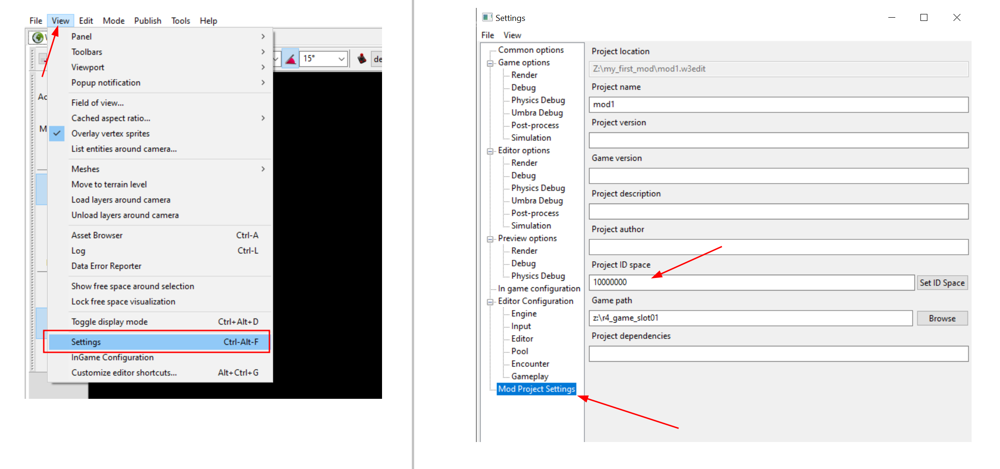

---
tags:
  - dlc
  - retddlc

status: new

---
# Шаг 1: Определение пространства ID для локализации
## Общие сведения
Перед началом любых действий в рамках мода, нужно обязательно определить пространство ID для локализации.
Так как на игру можно установить более одного мода, а моды DLC с вероятностью в 99% содержат строки, нужно убедится что внутренние ссылки на ID строки не будет конфликтовать между модами.

Для этого существует возможность установить стартовый ID с которого начнутся ваши идентификаторы строк в рамках DLC.

!!! info "Примечание"
    Собственные идентификаторы можно начинать с 10 000 000 (десять миллионов), однако не рекомендуется использовать именно это число, так как это наиболее очевидный выбор для других моддеров.
  
В качестве первых цифр мы рекомендуем использовать номер вашего DLC (см следующий шаг), а затем шесть нолей для достижения необходимого размера числа.

Например, если номер вашего DLC 77, пространство ID будет начинаться с 77000000.

## Установка пространства идентификаторов
Для установки пространства идентификаторов перейдите в **_View --> Settings --> Mod Project Settings_** и в поле **Project ID space** задайте стартовый идентификатор.

***
Автор: lxgdark

*Документация поддерживается участниками сообщества [REDkit RU](https://discord.gg/kRTEy8KcNa)*
***