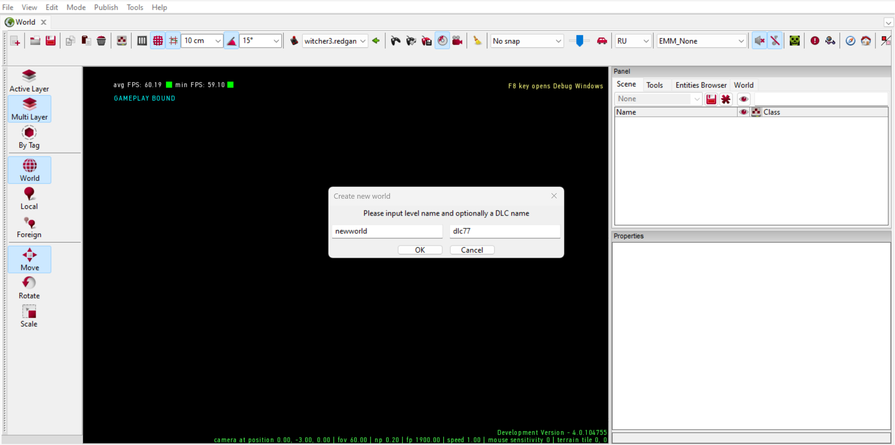
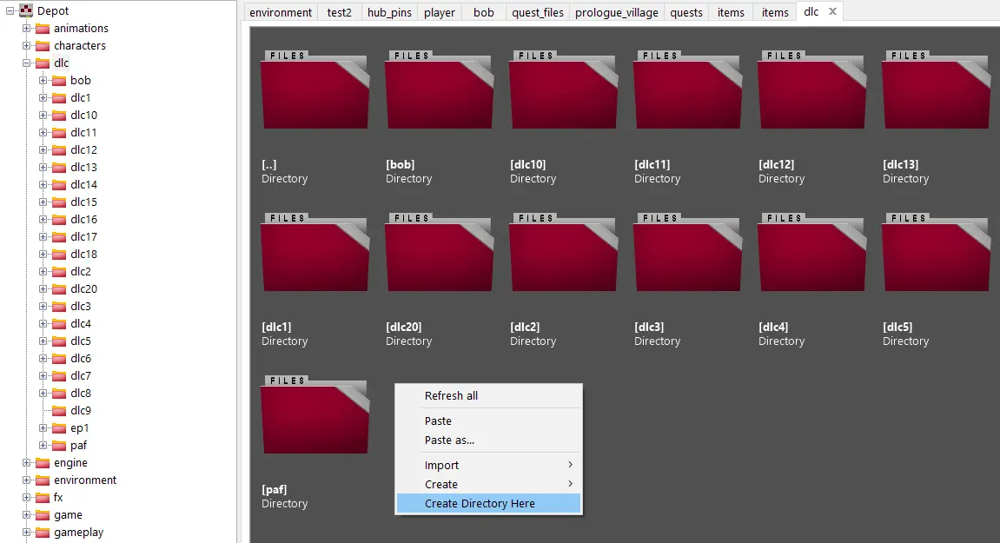

---
tags:
  - dlc
  - reddlc
  - structure

status: new

---
# Шаг 3: Структура папок

После выполнения предыдущих шагов, можно приступать к созданию места, где будут хранится все файлы мода.

Для начала вы должны определится, будет ли ваше DLC содержать новый мир (локацию), так как в случае если да, начальные действия по созданию структуры папок для DLC можно автоматизировать.

Дальнейшие действия будут отличатся в зависимости от того будет ли в вашем DLC новый мир или нет.

!!! docs "[Новый мир](#_1)"
    Вы планируете создавть новый мир.

!!! docs "[Существующий мир](#_2)"
    Вы планируете добавлять контент в рамках существующих миров.

## Новый мир

Для создания нового мира, выберите пункт меню **File --> New World** и в открывшемся меню введите имя для мира и имя вашего DLC (которое вы придумали шагом ранее).

!!! info "Подробнее"
    Подробнее о создании и настройке миров в [отдельном руководстве](../../world/world.md).

В результате этих действий будет не только создан новый игровой мир, но и автоматически создана базовая структура папок в [Asset Browser](../../../references/editors/asset_browser.md).

Путь к вашим файлам будет следующим: `dlc\dlcname`.

При переходе в папку DLC  вы заметите, что там уже создан ряд папок связанных с добавленным игровым миром. Именно поэтому  мы выполняем этот шаг так рано, так как это позволит минимизировать работу в будущем, а так же автоматизирует часть работы по неймингу папок.

!!! info "Примечание"
    Дальнейшую работу с миром пока можно отложить и продолжить начальниые настройки мода.

## Существующий мир
Если ваше DLC не предполагает создания нового мира, то для начала достаточно создать папку с именем DLC внутри папки "dlc". Как вы уже можете заметить в этой папке множество других DLC от самих разработчиков. Это хорошо, так как это поможет подсматривать структуру папок для создания единого стиля.

!!! warning "Важно!"
    Не спешите наполнять вашу папку подпапками, так как многие структуры папок создаются автоматически при выполнении определенных действий. Старайтесь создавать папки, только когда об этом сказано в конкретной статье руководства, дибо когда вы уверены, что ее расположение структурно верно!
***
Автор: lxgdark

*Документация поддерживается участниками сообщества [REDkit RU](https://discord.gg/kRTEy8KcNa)*
***
