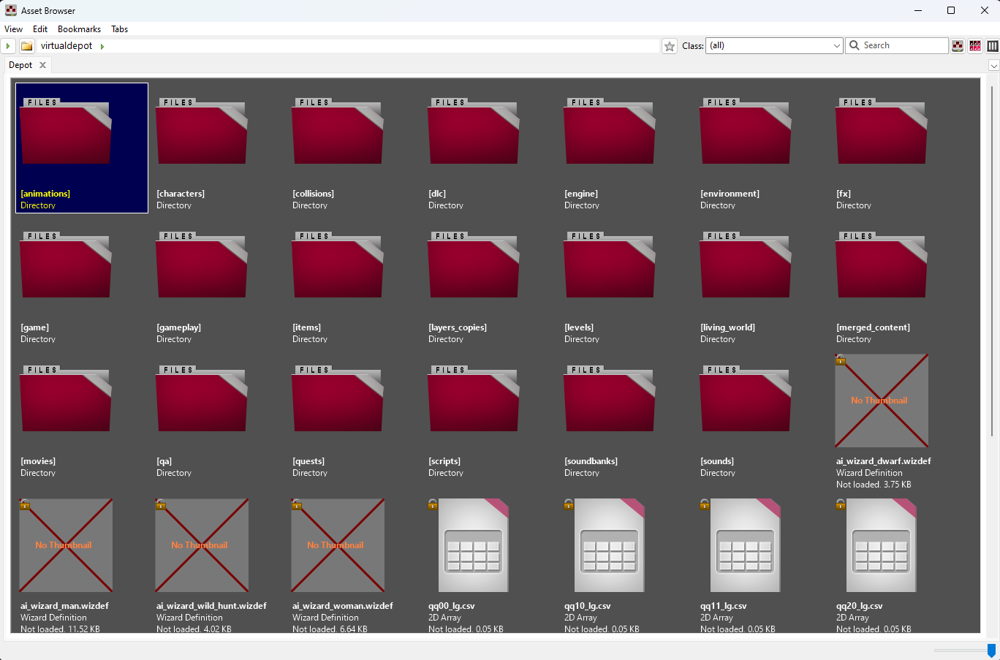
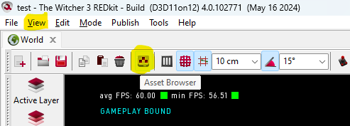
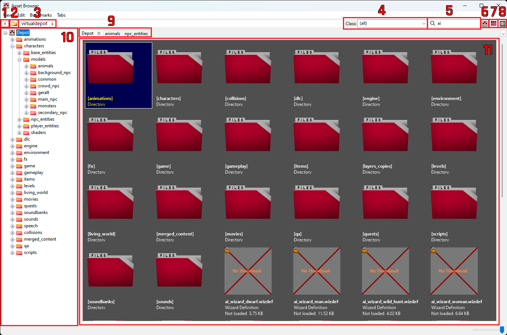
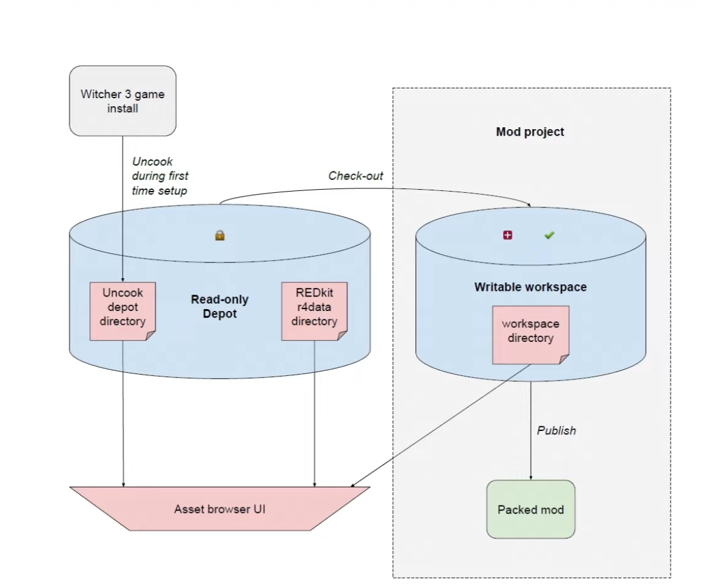
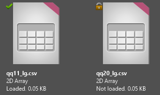

---
tags:
  - editor
  - asset
  - browser

status: new

---

# Asset Browser

Asset Browser - это инструмент, используемый для доступа ко всем файлам в репозитории REDkit. По сути, это аналог файлового проводника, который есть в любой операционной системе, но позволяет взаимодействовать с файлами как с объектами движка.

## Как открыть

Открыть Asset Browser можно несколькими способами:

- Сочетание клавиш: ++ctrl+a++
- Через меню: **View --> Asset Browser**
- Кликнуть на иконку в главной панели

Также Asset Browser автоматически открывается, когда необходимо выбрать объект для дальнейшего взаимодействия, например, чтобы открыть игровой мир через меню **File --> Open World**.

## Интерфейс

**Легенда:**

1. Показать/скрыть дерево каталогов Depot (10)
2. Создать новую папку
3. Путь до выбранной папки
4. Фильтр отображение по классу
5. Поле поиска
6. Переключатель где производить поиск
7. Отображение элементов в виде сетки
8. Отображение элементов в виде списка
9. Открытые вкладки
10. Древовидная структура Depot
11. Элементы выбранной папки

## Описание файловой структуры

Все оригинальные ресурсы игры хранятся в папке REDkit в каталоге r4data. Для оптимизации некоторые ресурсы извлекаются в отдельный "Uncook depot", который генерируется при первом запуске REDkit и хранится там, где вы его указали. Всё вместе это называется Read-only Depot или просто Depot. Эти ресурсы доступны только для чтения, и не рекомендуется изменять их за пределами REDkit, так как это может вызвать проблемы.

Ресурсы, которые доступны для изменения, хранятся в папке вашего проекта, называемой рабочим пространством или "Workspace". Asset Browser позволяет легко управлять этими ресурсами. Для удобного понимания, в каком именно хранилище находится файл, существуют специальные значки. Файлы из "Read-only Depot" имеют значок "замок", что означает, что это оригинальные ресурсы игры из Depot и их редактировать нельзя. Файлы из "Workspace" имеют два значка: зеленая галочка указывает на то, что это оригинальный ресурс игры, но скопированный в Workspace через команду Checkout, а значок плюса на красном фоне означает, что это новые ресурсы, добавленные через Import или Create.

## Основные возможности

### Создание новых ресурсов

Для создания новых ресурсов щелкните правой кнопкой мыши и выберите "Create". Новые файлы будут иметь значок "плюс", указывающий на то, что они новые и добавлены в рабочее пространство.

### Импорт внешних ресурсов

Для импорта внешних ресурсов щелкните правой кнопкой мыши и выберите "Import". Укажите путь к файлу на вашем ПК и задайте ему имя. Импортированные файлы также будут отображаться как новые в рабочем пространстве со значком "плюс".

### Изменение оригинальных ресурсов

Для изменения оригинальных ресурсов игры щелкните правой кнопкой мыши и выберите "Checkout". Это скопирует ресурс из Depot в рабочее пространство и снимет флаг только для чтения. Скопированные таким образом ресурсы будут иметь значок зеленой галочки.

### Редактировать объект

Чтобы отредактировать объект, дважды щелкните по нему левой кнопкой мыши в Asset Browser. Это автоматически откроет соответствующий редактор. Если вы откроете таким образом оригинальный ресурс из Depot, то при сохранении появится предупреждение о необходимости переместить файл в рабочее пространство.

### Восстановление файлов

Если вы случайно изменили файл и сохранили его в своё рабочее пространство, его можно восстановить, выбрав "Revert". Это удалит файл из рабочего пространства, и можно будет работать с оригинальным ресурсом из Depot. Будьте осторожны, так как при этом файл будет удален физически и не подлежит восстановлению. Если это сделать с новыми ресурсами, то это просто удалит их.

### Копирование, вставка и переименование

Вы можете копировать и вставлять файлы из Asset Browser. Скопированные файлы будут иметь значок "плюс". Переименовывать можно только новые файлы из рабочего пространства. Файлы игры, даже сохранённые в рабочее пространство, нельзя переименовать.

### Поиск

Для поиска нужных элементов можно использовать два варианта: фильтр по классу или поиск по имени. Фильтр по классу работает моментально, но имеет ограничения в виде возможности выбрать только один класс. Результат поиска по имени отображается в отдельной вкладке. С помощью переключателя можно выбрать, где производить поиск: в текущей папке (иконка папки) или по всем ресурсам в Depot (иконка Asset Browser). Для поиска по расширению файла достаточно просто написать его, например ".csv".

### Добавление объекта в сцену

Для того, чтобы добавить объект из Asset Browser в мир (например, шаблон сущности), выполните одно из следующих действий:

- Выберите объект ЛКМ в Asset Browser, затем щёлкните правой кнопкой мыши в предварительном просмотре мира.
- Перетащите объект из Asset Browser непосредственно в предварительный просмотр мира ("Viewport").

### Закрепление в основном окне

По умолчанию окно Asset Browser открывается в отдельном окне. Для того чтобы закрепить его в виде вкладки рядом с вкладкой World, в интерфейсе Asset Browser нажмите View -> Dock или используйте комбинацию клавиш CTRL + D.

## Решение проблем

### Крашинг REDkit

Если REDkit постоянно вылетает при запуске, загрузке файла или уровне, это может указывать на повреждение ресурсов. Возможные решения:

- **Проверка целостности файлов через Steam:** Это можно сделать, зайдя в свойства игры и выбрав соответствующую опцию.
- **Повторное извлечение "Uncook depot"**: Для этого вручную удалите Uncook depot и перезапустите REDkit для его повторной генерации.
- **Восстановление ресурсов в Workspace:**
  - Если вы используете систему контроля версий, например, Git, можно откатиться к предыдущей версии.
  - Если системы контроля версий нет, создайте новый проект и добавляйте в него файлы по одному, чтобы выявить повреждённый.

Если ничего не помогает, можно использовать кнопку "Report a bug" для отправки отчета о проблеме.

***
Автор: Сообщество

*Документация поддерживается участниками сообщества [REDkit RU](https://discord.gg/kRTEy8KcNa)*
***
