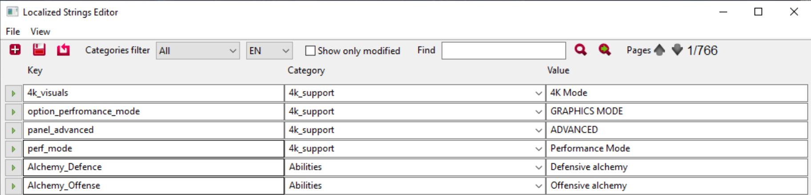

---
tags:
  - editor
  - localization
  - strings

status: new

---

# Редактор локализуемых строк (Localized Strings Editor)
Редактор локализуемых строк (Localized Strings Editor) предназначен для ведения базы всех ваших текстовых строк для простого доступа к ним и, самое главное, удобного перевода на другие языки.

## Работа с редактором
Для запуска редактора строк, выберите меню **_Tools --> Localized Strings Editor_**.
Редактор откроется в новом окне

Первый шаг при работе с редактором - это выбор основного языка с котором вы планируете работать в процессе создания мода.

!!! info "Примечание"
    Вы можете вести несколько языков параллельно, однако гораздо удобнее добавлять все строки на одном языке, а затем переводить их на другие одним пакетом.

После выбора основного языка вы увидите список всех строк используемых в игре на данный момент. Это может пригодится как для поиска ключей известных вам строк, так и для применения их в качестве референса.

Для поиска строки введите часть текста или ключ в поле **Find** и нажмите **Enter**.

Кроме того вам доступна два вида фильтра - по категории и по модифицированным строкам. Выбрав категорию из списка, вы увидите только те строки, что относятся к этой категории. Поставив галочку **Show only modified** вы получите только те строки, которые были добавлены или отредактированы (удобно для просмотра только тех строк, что добавили вы).

Для добавления новой строки нажмите на кнопку (+) в результате чего в таблице строк появится новая строка внизу страницы.

Непосредственно редактор строк состоит из таблицы, содержащей три колонки:

- левая колонка это ключ (на английском, маленькими буквами без пробелов), по которому вы будете обращаться к вашим строкам из других мест мода.
- средняя колонка это группа к которой вы относите вашу троку (можно выбрать имеющуюся или вписать свою).
- правая колонка содержит непосредственно текст, который вы хотите отображать в игре (на том языке на котором вы выбрали в любом стиле и формате написания)

После ввода данных в колонки, нажмите кнопку сохранения, чтобы зафиксировать изменения в базе данных.

## Локализация

Рано или поздно у вас может возникнуть необходимость перевести ваши строки на другие языки. Для этого существует два способа:

1. Переключить язык прямо в редакторе. В таком случае каждая ваша строка будет иметь пустое место в колонке текста. Мы можете вписать туда текст на выбранном языке и сохранить изменения.
2. Более верный способ - это экспорт строк в отдельный файл и загрузка их после локализации.

!!! info "Примечание"
    Второй способ предпочтителен, так как в REDkit есть множество мест, где строки заполняются вне этого редактора и не отображаются в нем. Локализация таких строк возможна только через выгрузку в файл.

Для выгрузки строк в файл для последующей локализации, используйте пункт меню **File --> Export** внутри редактора. В результате все текстовые строки будут выгружены в файл формата **.csv**, который автоматически поместится в корневую папку проекта рядом с файлом **.w3edit**.

Полученный файл представляет собой стандартный формат строковой таблицы с разделителем в виде запятой. Редактировать этот файл можно во множестве программ разной степени удобства. Не плохим вариантом будет **Microsoft Excel**.

После перевода строк на другие языки, результат нужно загрузить обратно в редактор через пункт меню **File --> Import**.

!!! warning "Важно!"
    Вышеописанным способом рекомендуется только редактировать строки с целю проверки орфографии или локализации, тогда как создание новых строк, нужно делать через Localized Strings Editor.

***
Автор: lxgdark

*Документация поддерживается участниками сообщества [REDkit RU](https://discord.gg/kRTEy8KcNa)*
***