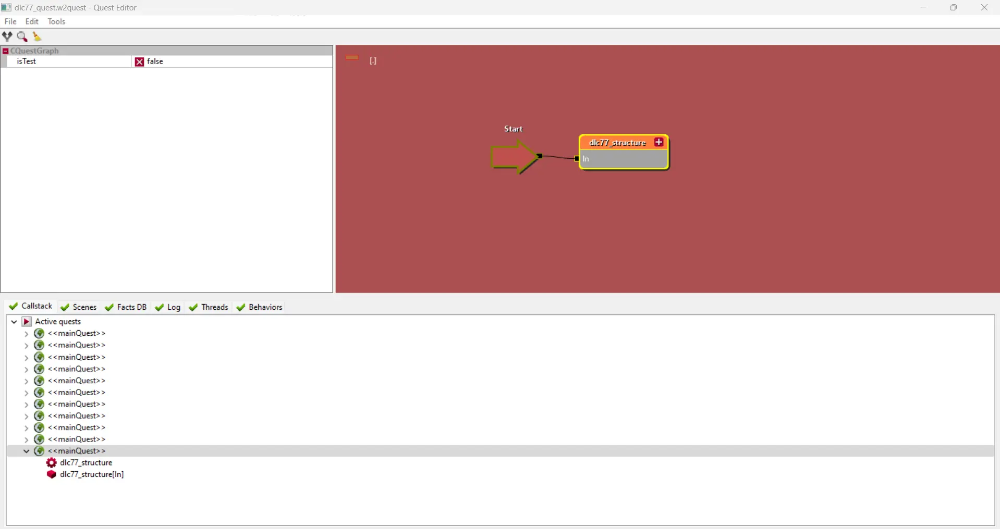
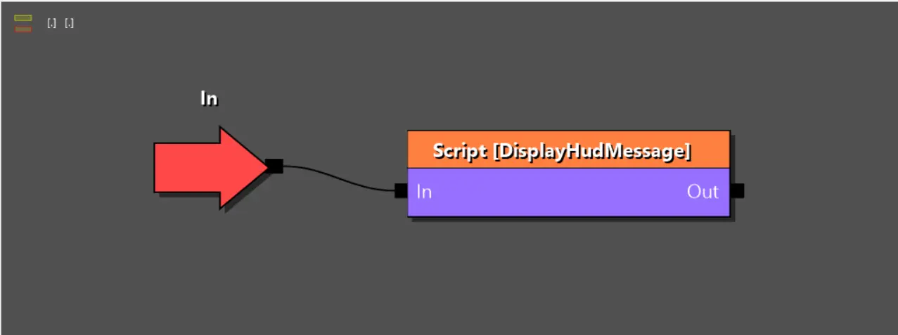
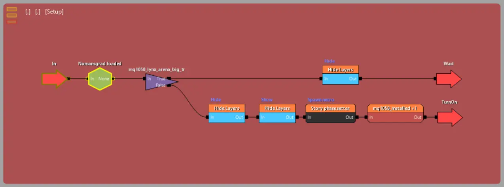

---
tags:
  - quest
  - основы
  - w2quest
  - w2phase
  
status: new
---

# Отладка квестов

## Запуск отладки

В процессе тестирования квестов вам, вероятно, потребуется отслеживать текущее состояние вашего сюжета, а так же понимать какое значение в данный момент имеют те или иные факты. К счастью разработчики предоставили инструмент, который нам в этом поможет.

Для начала запустите игру в REDkit с помощью файла сохранения или используя шаблон **.redgame**. После того как игра запустится нажмите клавишу ++"Pause/Break"++ для передачи фокуса в редактор. Теперь в главном окне выберите пункт меню **"Tools --> Debuggers --> Quests Debugger"**, чтобы открыть отладчик квестов.

По умолчанию окно отладчика будет пустым, так как нам нужно выбрать файл квеста, который мы хотим просматривать.
Для этого внизу выберите вкладку **"Callstack"** и раскройте список **"Active quests"**. В списке будут представлены все файлы квестов выполняющиеся в игре. Раскрывая списки элементов со значком планеты вы увидите два типа элементов: шестеренка, отображающая фазу как группу и прямоугольник, позволяющий эту фазу открыть (двойной щелчок).

Открыв нужный квест вы можете осуществлять навигацию по нему как в обычном [редакторе квестов](editor.md).

## Работа с отладчиком

Несмотря на то, что отладчик во многом похож на обычный редактор квестов, он все же имеет существенные отличия связанные с цветовой индикацией. Во-первых если, фаза в которой вы находитесь активна, то цвет фона на холсте будет красным. Во-вторых, блок на котором сейчас остановился луч, будет иметь желтую обводку.

Например, блок фазы на картинке выше имеет желтую обводку, что значит, что луч внутри блока. Так же фон холста красный, что значит, что на луч активен и находится на одно из уровней вложенности.

Однако, если перейти в фазу из показанного выше примера, то мы увидим серый фон и отсутствие желтой обводки на блоках. Это связано с тем, что луч прошел все блоки, но не покинул фазу, так как у фазы нет соединенного блока **Out**.

Это наглядный пример не верного проектирования, так как отсутствие блока **Out** имеет смысл только при наличии зацикленных структур внутри фазы. Благо пример построен на основе квеста из [тестового DLC](../../base/dlc/dlc_mods/dlc_quest.md), поэтому мы можем не переживать относительно неразумного расходования ресурсов ПК, так как в будущем квест будет доработан.

Если же изучить содержимое правильно-написанной фазы из существующих квестов, мы увидим более реалистичную картину.

Например на этом скрине мы наглядно видим, что луч ожидает выполнения некого условия в блоке паузы и, как только это условие выполняется, луч продолжит свой путь выполняя заложенную далее логику. К слову вы можете видеть это в режиме онлайн, если поместите отладчик на второй экран, пока на первом будете выполнять тестовый забег.

## Факты

Как уже говорилось в [основном руководстве](general.md/#_6) одна из важных частей проектирование квестов, это установка и реагирование на факты. Логично предположить, что мы хотели бы понимать какие факты уже были установлены (и с каким значением). К счастью отладчик квестов предоставляет и такую возможность. Для этого в нижней панели перейдите на вкладку **"Facts DB"**.

В этой вкладке вы увидите список всех загруженных фактов игры (все что были загружены из сохранения или были установлены за время тестового забега но не те, что еще не разу не были установлены). К сожалению окно не дает нам никаких фильтров, кроме поиска по имени, поэтому в идеале вы должны знать название факта, который ищите. После того, как вы найдете нужный факт и выделите его, в правой части окошка появится записи о том, когда и с каким значением этот факт был установлен.

!!! info "Примечание"
    Чтобы в будущем избежать проблем при поиске фактов относящихся к вашему моду, стоит в названии ваших фактов делать некоторую идентификационную приписку. Например, если у вас DLC-мод, то приписывайте в названии факта имя этого мода (например **dlc77_q001_start_fact**).
***
Автор: lxgdark

*Документация поддерживается участниками сообщества [REDkit RU](https://discord.gg/kRTEy8KcNa)*
***
