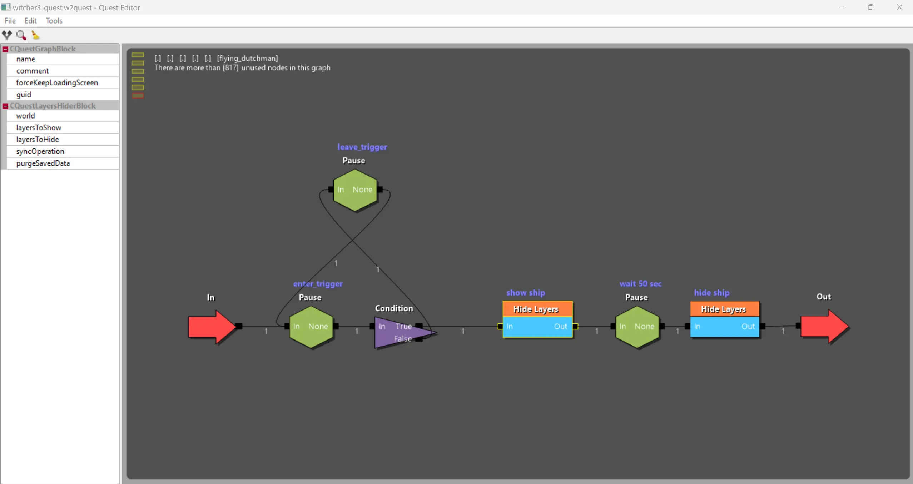
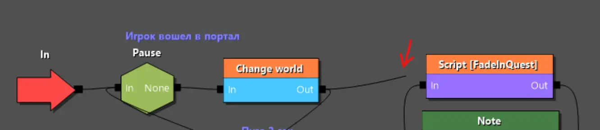

---
tags:
  - quest
  - editor
  - questeditor
  - основы
  - w2quest
  - w2phase
  
status: new
---

# Редактор файлов квестов

Для файлов формата **w2quest** и **w2phase** существует встроенный редактор - редактор квестов. Так как оба типа файла по сути своей отличаются лишь назначением (см. [основы](general.md)) работа с обоими типами файлов полностью идентичная.

!!! info "Примечание"
    Данное руководство не является исчерпывающим и охватывает лишь наиболее важные функции редактора.

Для начала работы с редактором откройте или создайте файл формата **w2quest** или **w2phase**. В качестве примера в [Asset Browser](../../../references/editors/asset_browser.md) перейдем в папку **quests** и найдем там файл **witcher3_quest.w2quest**. Это главный файл квеста всей игры, на примере которого мы и рассмотрим основные функции редактора.

## Навигация

Основной блок редактора, на котором расположены все квестовые блоки представляет из себя бесконечный холст, который мы можем передвигать с помощью зажатой ++пкм++ и менять его масштаб с помощью ++"вращения колеса мыши"++.

Так как часть блоков представляют из себя блоки фаз ([подробнее](general.md/#работа-с-файлами-квеста)), хранящие в себе вложенную структуру, вы можете перейти внутрь с помощью ++"двойного щелчка лкм"++. ++"Двойной щелчок лкм"++ по пустому месту холста подымет вас на уровень выше.

Для определения уровня вложенности при навигации по фазам вам, вероятно, будет важно понимать как далеко вы забрались от первоначального файла. Для этого в левом верхнем углу холста есть набор салатовых прямоугольников. Самый нижний из них будет обведен красным, показывая ваше текущее местоположение в глубине вложенности.

## Управление

При работе в редакторе большую часть времени вы будете создавать, настраивать и соединять блоки.

Для создания блока нажмите ++пкм++ на пустом месте холста и, в открывшемся контекстном меню, выберите блок, который вы хотите добавить. Новый блок появится в том месте, где вы кликнули и не будет ни с чем соединен.

Для перемещения блока наведите на него мышь и, зажав ++лкм++, перетащите блок в нужное место холста. ++пкм++ по блоку, вызовет его контекстное меню с важными действиями для блока.

Теперь необходимо соединить блок с другими блоками. Для этого наведите мышь на черный квадрат слева (**входная точка**) или справа (**выходная точка**) от блока. Зажмите ++лкм++ и ведите до черного квадрата у другого блока.

!!! warning "Важно!"
    Распространение [луча](general.md/#принцип-работы-квеста-луч) по квесту происходит слева на право, поэтому вы не сможете соединить выходную точку одного блока с выходной точкой другого. Так же вы не сможете соединить выходные и входные точки одного блока. Однако соединять выходные и входные точки разных блоков вы можете в любом порядке и на любой дистанции. Кроме того соединительные точки не имеют ограничений по количеству входящих или исходящих соединений. 

После размещения блока вам потребуется настроить его, указав свойства блока. Для этого выделите его с помощью ++пкм++ и перейдите в левую колонку редактора. Там вы увидите полный набор свойств выделенного блока и сможете настроить, указав необходимы значения.

!!! info "Примечание"
    Некоторые блоки имеют разное количество входных и выходных точек и их число может меняться в зависимости от настроек. Для таких блоков имеет смысл сначала указать настройки и только потом соединять его с остальными блоками.

## Полезные действия

### Пересборка соединительных точек

Существует типы блоков, у которых количество входных точек определяется в отдельном фале этого блока. Таким блоками, например, являются блоки вызова игровых сцен или блоки фаз. Иногда редактор не подхватывает изменения в количестве соединительных точек, поэтому вам будет полезна функция **Rebuild sockets**. Для этого нажмите ++пкм++ на нужный блок и, в открывшемся контекстном меню, выберите соответствующий пункт.

### Отключение/удаление соединений

Если в процессе работы вам потребуется временно отключить какое либо соединение, вам достаточно просто нажать на соединение с помощью ++лкм++. После такого действия линия соединения станет полупрозрачной, а по середине ее пути появится красный крестик.

Если же вы хотите удалить соединение, то вам нужно нажать ++пкм++ на соединительную точку и в контекстном меню выбрать **"Break All Links"** (для отсоединения от точки всех линий) или **"Break Link To"** (для выбора конкретного блока от которого нужно отсоединится).

### Удаление блоков

Несмотря на то, что удаление блоков может оказаться очевидной операцией не все так просто. Во-первых да, удалить блок можно либо с помощью контекстного меню, либо с помощью ++del++ когда блок выбран, однако если квест сохранен и внедрен в игру, на месте удаленного блока появится блок **Deletion marker**, который является заглушкой задача которого сохранить непрерывность **луча** при загрузке сохранений, а так же пометить место, где что-то было удалено. Удалить сам **Deletion marker** нельзя, как как он является частью системы безопасности.

Если вы осознаете свои действия и точно уверены, что **Deletion marker** вам не нужен, вам потребуется отсоединить от него все линии (см. выше) и затем нажать на иконку веника 🧹 в левом верхнем углу редактора. Появится окно которое предложит удалить все  блоки не соединенные линией с другими блоками. Нажав **Yes** вы уберете **Deletion marker** (а с ним и все прочие не соединенные блоки).

### Поиск блоков

В файле по типу **witcher3_quest.w2quest** огромная структура и тысяч блоков на множестве уровней. Найти что либо в такой структуре методом перебора может быть очень сложно, поэтому разработчики предоставили инструмент поиска блоков.

Для открытия окна поиска нажмите на значок лупы чуть выше редактора свойств (или откройте пункт меню **"Edit --> Find"**). В открывшемся окне вы найдете множество способов для поиска блоков, а так же возможность выгрузить результаты в XML.

!!! warning "Важно!"
    Попытка поиска по основному игровому квесту быстро приведет вас к отчаянию, так как разработчики не озаботились именованием важных квестовых блоков. Держите это в голове, при создании своего мода и старайтесь именовать все важные блоки, чтобы затем иметь возможность быстро найти их.

### Сохранение

Так как REDkit был выкован в горнилах ада, одна из пыток что он предоставляет - это постоянные вылеты и потери данных. Помня это, не пренебрегайте пунктом меню **"File --> Save"**. Сохраняйте ваши изменения как можно чаще, особенно перед переключением на другие окна редактора.

!!! info "Примечание"
    Если вы хотите сохранить изменения сразу во всех файлах входящих в открытую структуру, вы можете воспользоваться пунктом меню **"File --> Save all"**, однако пользуйтесь этим типом сохранения с осторожностью. Сохранение всех файлов структуры может занять время, а так же привести к падению редактора.

***
Автор: lxgdark

*Документация поддерживается участниками сообщества [REDkit RU](https://discord.gg/kRTEy8KcNa)*
***
