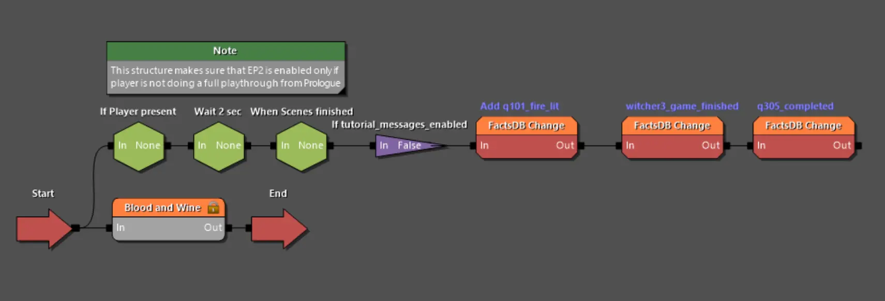
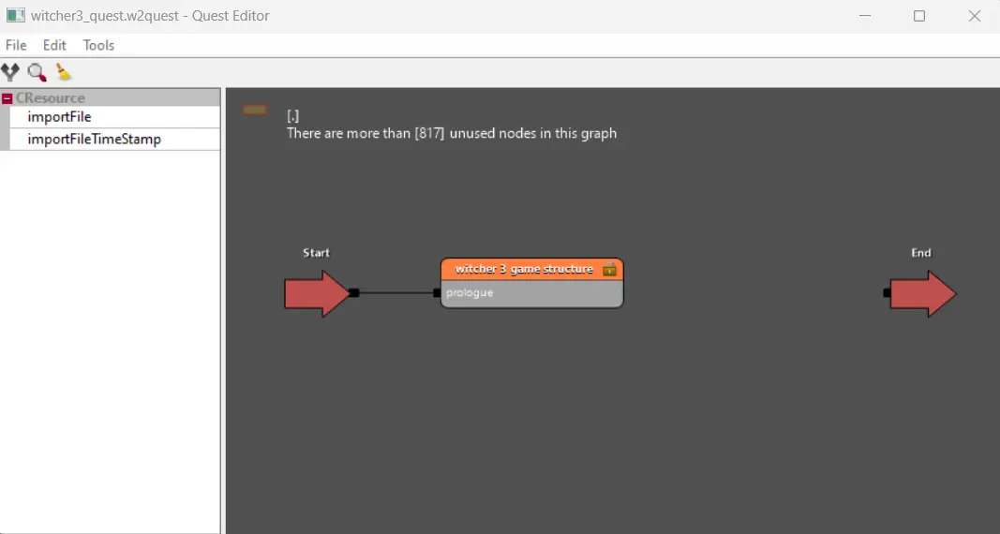
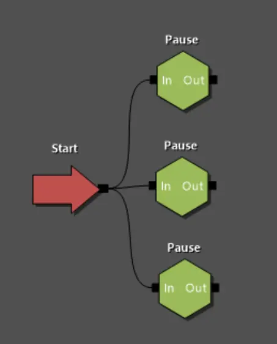

---
tags:
  - quest
  - основы
  - w2quest
  - w2phase
  
status: new
---

# Общие данные о квестах

## Понятие квеста

В отличии от привычного понятия квеста, **квест** в рамках REDkit это главный элемент обеспечивающий отслеживание состояния игры, тесно связанный с текущим положением игрока в сюжетном повествовании.

В рамках работы в REDkit нужно правильно понимать понятие квеста. То, что рядовой игрок называет квестом в игре, является лишь малой частью понятия. Описание задания и указания игроку определяются в **журнале**, тогда как **квест** - это более обширное понятие включающее в себя программирование поведения игры для ее движения по линии сюжета.

## Работа с файлами квеста

В REDkit есть два типа файлов, отвечающих за работу квеста: основной и вспомогательный. Основной файл имеет формат **w2quest**, а вспомогательный **w2phase**.
Фйл **w2quest** является точкой входа в сюжет основной игры или DLC. Например, если вы откроете файл по пути **quests\witcher3_quest.w2quest**, то попадете в структуру основной игры. В этом файле описана вся логика и поведение игры от первого запуска до финальных титров.

Обычно в рамках отдельной части игры (основная игра или DLC) используется один файл формата **w2quest** с которого и начинается выполнение игровой части. Единственная причина по которой таких файлов может быть несколько - это отладочные квесты (см. [отладка квестов](debug.md)).

Открыв файл квеста основной игры, вы можете заметить в нем всего один блок, что не похоже на сложную структуру отвечающую за повествование всей игры.

Все дело во втором типе файла **w2phase**. В отличии от основного файла, таких файлов может быть бесконечное множество (и собственно практически все файлы в папке "quests" и ее подпапках это файлы типа "фаза"). Каждый файл **w2phase** это своего рода группа блоков и внутри такого файла может быть указатель на другой файл фазы (или несколько), что делает структуру квеста многоуровневой и упорядоченной.

Таким образом когда вы дважды щелкните на оранжевый блок в основном файле квеста, вы попадете в файл фазы, который содержит общую структуру игры. В этой пространстве так же есть блоки фаз, в которые также можно провалится двойным щелчком.

!!! info "Примечание"
    При навигации по структуре квеста, чтобы вернутся на уровень выше, дважды щелкните на пустое пространство (серый фон).

Еще одной особенностью навигации по файлам **w2phase** является то, что вы можете открыть файл фазы сразу из [Asset Browser](../../../references/editors/asset_browser.md), что позволит вам быстрее попасть на нужный уровень (но не позволит подняться на уровень выше). Проще говоря перемещаясь внутри блоков фазы, вы по сути открываете отдельные файлы **w2phase**.

Впрочем фаза не обязательно должна иметь основу в виде фала. Создав блок фазы, вы можете перейти в нее и настраивать как обычно, при этом не задавай путь к файлу **w2phase**, однако наличие основы в виде файла упрощает работу со структурой и делает основной файл квеста меньше размером на носителе.

!!! info "Примечание"
    Подробнее о работе с редактором квестов описано на [соответствующей](editor.md) странице.

## Принцип работы квеста (луч)

При запуске файла квеста, игровой движок ищет внутри блок **Start** с которого начинает свое движение так называемый **луч**. Как вы уже могли заметить, каждый блок внутри квеста соединяется с другими блоками одним или несколькими линиями. Эти линии являются своего рода дорогами для прохождения игрового **луча**, а текущее его положение определяет где именно вы находитесь в повествовании.

Луч запускается из блока **Start** и распространяется по всем исходящим линиям к следующим блокам (слева на права). Достигая блока происходит его выполнение или, например в случае с блоком **Пауза (Pause)**, ожидает выполнения условий, чтобы пойти дальше.

Когда луч попадает в блок **фазы (w2phase)**, он переходит к блоку **In** внутри фазы и распространяется от него ко всем прикрепленным блокам. Таким образом **луч** распространяется по всей иерархии блоков на все возможные уровни углубления, пока не достигнет финальных блоков.

!!! warning "Важно!"
    Когда **луч** достигает блока **Out** внутри **фазы**, вся фаза прекращает свою работу и считается завершенной. Если внутри файла фазы были ожидания или циклы, они прервутся и более никогда не выполнятся.
    Впрочем если ваша фаза подразумевает существование на протяжении всей игры, вы можете просто не соединять конечный блок фазы с блоком **Out**.

## Принцип работы квеста (ожидание)

Вторым важным принципом работы квеста можно считать блоки пауз и условий. Концептуально в каждый момент времени десятки или сотни блоков ожидают срабатывания какого то события (или выполнения условия). Таким образом вышеописанный луч практически всегда находится в одном из блоков ожидания, а после срабатывания блока, проходит по следующим блокам, пока снова не упрется в ожидание.

Именно так работают файлы сохранения игры. Пока вы видите экран загрузки, игра загружает все предметы игрока, мира и персонажей, а так же устанавливает все сработавшие игровые факты (см. ниже). Потом **луч** выходит из блока **Start** всех подгруженных квестов и пробегает по всем блокам пока не упрется в блоки ожидания, условия которых еще не отработали (блоки пауз в данном случае пропускаются)

## Факты

Как уже упоминалось выше структура блоков переполнена различными условиями и ожиданиями. Такие блоки поддерживают множество условий для срабатывания, например, появление в инвентаре некоторого предмета (или суммы предметов), но чаще всего основополагающим условием будет установка **факта**.

Факт - это переменная или, если хотите, ячейка в памяти в которую мы помещаем некоторое значение. Установить факт, можно множеством разных способ, как с помощью блоков в файле квеста, так и автоматически в свойствах разных игровых сущностей. Например в игре есть триггер-зоны, в настройках которых можно указать имя факта, который будет установлен при посещении этой зоны. Либо существует шаблон портала, где так же можно указать факт, который будет зада при проходе через портал.

Факты являются важной частью в создании структуры квестов, так как они хранят информацию о состоянии той или иной части игры и позволяют отслеживать самые разные изменения (или регулярные действия).

!!! info "Примечание"
    Так как в REDkit нет встроенной базы данных фактов, рекомендуется завести отдельный файл (например в Excel), где вы будете сохранять имена и назначение фактов, которые вы придумали для использования мода.

***
Автор: lxgdark

*Документация поддерживается участниками сообщества [REDkit RU](https://discord.gg/kRTEy8KcNa)*
***
