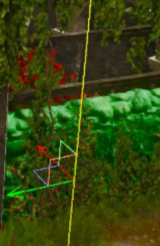

---
tags:
  - Полезное
  - Редактор
  - Сочетания клавиш
---

# Полезные сочетания клавиш

Коллекция полезных горячих клавиш для решения рутинных задач в редакторе.

## Редактор мира
### Объекты

- Выделите два объекта на карте и нажмите ++m++, чтобы скопировать свойства трансформации и координаты. 
Позволяет перенести любые значения трансформации с одного объекта на другой. 
В случае с позицией, так же позволяет отцентрировать объекты относительно друг друга. 
Например, вы расположили на карте экстерьер дома и теперь хотите разместить интерьер так, чтобы он совпадал. 
Это инструмент поможет установить интерьер по координатам экстерьера, 
а также применить повороты и сжатия (если таковые были)

    { style="width: 25%;" }

- Когда у вас выделен объект, вы можете продублировать его в направлении одной из осей. 
Для этого зажмите ++shift++ и передвиньте объект в нужном направлении. 
Удобно при строительстве заборов, набрасывании камней и прочей работ с ландшафтом, 
требующей дублирования элемента по одной из оcей координат.

    { style="width: 25%;" }

- ++x++ / ++y++ / ++z++ для быстрого перемещения по соответствующей оси. 
Удобно, если в текущем положении камеры сложно попасть на нужную стрелочку оси.

    { style="width: 25%;" }

- ++ctrl+shift+e++ – выделить все схожие w2ent в небольшом радиусе. 
Позволяет выбрать все ближайшие одинаковые объекты для групповой работы с ними.

### Камера

- ++w++ / ++a++ / ++s++ / ++d++ – перемещение по карте. 
Так же можно использовать ++лкм++ + движением мышью (но этот вариант менее отзывчивый).

- ++пкм++ – поворот камеры.
- ++shift++ – ускоряет перемещение камеры в 5 раз.
- ++лкм+"вращение колесика мыши"++ – увеличение/уменьшение скорости камеры.
    
- ++j++ – для быстрого перемещения на точку в которую смотрит курсор. 
Курсор должен указывать на объект или ландшафт (не в пустоту). 
Удобно для быстрой навигации по карте.
- ++ctrl+alt+"0...9"++ – сохранит текущее положение камеры. 
++ctrl+"0...9"++ позволит быстро перейти к сохраненным положением. 
Удобно использовать как избранное на карте или рассматривать что-либо под конкретным углом.
- ++ctrl+alt+c++ – копирует положение камеры.
- ++ctrl+alt+v++ – перемещает камеру в ранее скопированные координаты.

### Ландшафт

- ++"Вращение колесиком мыши"++ – меняет размер кисти.

    _При использовании Shape Brush - Stamp._
    

- ++"~"++ - инвертирует Stamp, позволяя рисовать рельефные впадины. Зависит от на стройки Intensity.
- ++ctrl+"движение мышью влево/вправо"++ – позволяет быстро изменить угол штампа.
- ++alt+лкм++ - при использовании Stamp позволяет клонировать рельеф, при этом клонируются и текстуры. 
Если проставить значение fallout - 0, то при рисовании таким штампом рельеф изменяться не будет, 
будут лишь переноситься текстуры. Удобно для создания типовых ландшафтов с заранее заготовленной схемой.

     

- ++alt+"ЛКМ/ПКМ"++ по материалу в списке материалов проставляет его как вертикальную/горизонтальную маску. 
Маска позволяет рисовать только по текстуре, которая выбрана в маске. 
Если включить галочку Inv, то напротив рисование будет по всем текстурам кроме текстуры в маске.

    

## Отладка игры

- ++alt+enter++ - полноэкранный режим. При наличии второго монитора игра развернется на нем.
- ++"`"++ - открывает консоль отладки.
- ++f10++ – завершает игровую отладку.
- ++"Pause/Break"++ – ставит паузу в игре и возвращает фокус на редактор. 
Удобно, если вы, например хотите вызвать отладку квестов или прочие debuggers.
- ++num-plus++ или "num-minus" - увеличивает/уменьшает скорость времени. Позволяет ускорить или замедлить все в игре. 
В результате Геральт может передвигаться ака Соник, или напротив ползти как после попойки. 
Удобно для промотки времени или быстрого перемещения по карте. 
- Либо напротив лучше рассмотреть анимацию при замедлении.
- ++num1++ – убивает всех врагов в небольшом радиусе.
- ++num2++ – убивает врага, на которого смотрит ГГ. 
Удобно для отладки игровых скриптов без траты время на бой.

***
Авторы: lxgdark, x4lva

*Документация поддерживается участниками сообщества [REDkit RU](https://discord.gg/kRTEy8KcNa)*
***