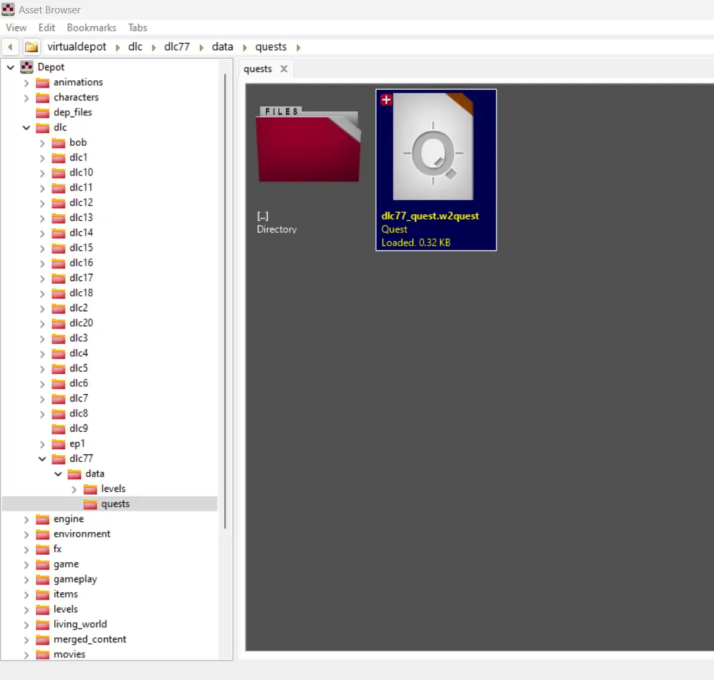
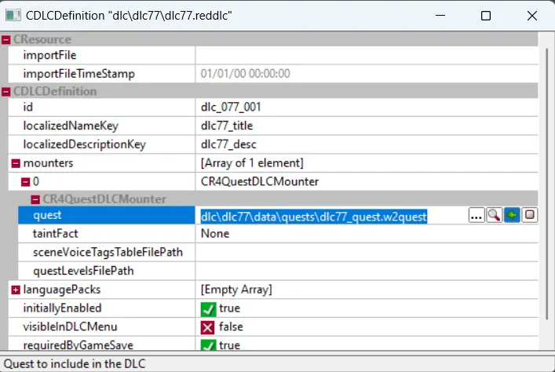
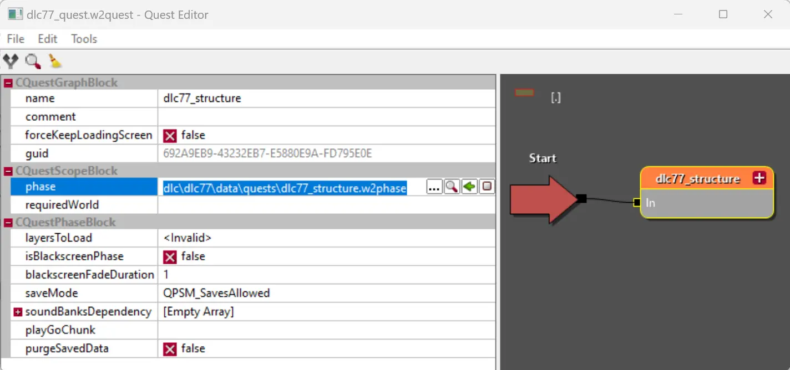

---
tags:
  - dlc
  - quest
  - reddlc
  - w2quest
  - w2phase
  
status: new
---

# Квестовый DLC-мод

Если ваш мод содержит хотя бы минимальное сюжетное взаимодействие с игроком, вам обязательно потребует реализовать свой **DLC-квест**. В отличии от модификации основной игры, квест в DLC запускается одновременно с главным квестом игры и не не может изменять текущий сюжет. Таким образом этот вариант подходит, если вы планируете добавлять новые сюжетные события или крупные DLC сюжеты по типу "Каменные сердца" или "Кровь и Вино".

!!! info "Примечание"
    Подробнее о понятии **квеста** и принципе его работы читайте в [соответствующем разделе](../../../references/quest/general.md) справки.

## Создание файла квеста

Перейдите в папку вашего DLC (далее в примере будет использоваться имя dlc77) и создайте папки так, чтобы они образовывали путь **"dlc --> dlc77 --> data --> quests"**. Внутри созданной папки, нажмите правой кнопкой мыши на пустое место и выберите пункт меню **"Create --> Quest"**. В качестве имени файла используйте **"dlc77_quest"**.

После того, как вы создадите и откроете файл, вы заметите, что он не содержит вообще никаких блоков. Это нормально, однако в таком виде этот фал бесполезен и даже не будет запущен. Чтобы файл мог выполнятся, нужно добавить стартовый блок.

Для создания стартового блока, нажмите правой кнопкой мыши на пустом месте холста (с серым фоном) и в открывшемся меню выберите **"Complexity management --> Start"**. Сохраните файл через меню **"File --> Save"** или комбинацию клавиш ++ctrl+s++. После этого редактор пока можно закрыть.

## Настройка файла DLC

Для того, чтобы игра узнала о новом файле квеста, который необходимо запустить параллельно с остальными, нам необходимо указать соответствующий [маунтер](../../../references/dlc/dlc_mounters.md) в [определение](../dlc_steps/step_4.md) нашего DLC.

Перейдите в корневую папку вашего DLC и откройте ранее созданный файл **.reddlc**. В открывшемся окне выделите строку **"mounters"** и справа нажмите на зеленую иконку ➕. В результате нажатия появится новая пустая строка строка. Теперь выделите эту строку и нажмите на красный перевернутый треугольник -🔻. В результате откроется окно со списком маунтеров, в котором нужно будет выбрать элемент с названием **"CR4QuestDLCMounter"**. Сделайте двойной щелчок по маунтеру, чтобы добавить его DLC.

Добавленный маунтер содержит четыре свойства, подробнее о которых вы можете посмотреть [здесь](../../../references/dlc/dlc_mounters.md/#cr4questdlcmounter), однако нас сейчас интересует только поле **"quest"**, которое содержит пусть к нашему файлу квеста.

Не закрывая окно **DLC Definition**, прейдите в [Asset Browser](../../../references/editors/asset_browser.md) и вернитесь к нашему файлу **"dlc77_quest"**. Выделите его и переключитесь снова на окно **DLC Definition**. Нажмите на свойство **"quest"** и после на появившуюся справа зеленую стрелочку ⬅. Путь к вашему файлу квест будет задан.

Закройте окно редактирования **DLC Definition** и в появившемся запросе на сохранение, нажмите **"Yes"**. Теперь игра знает о вашем файле квеста и будет запускать его при старте игры (как новой, так и из сохранения).

## Структура квеста

Как было описано в [основном материале](../../../references/quest/general.md) о работе квестов, для удобства работы с большой структурой, нам необходимо дробить логики на отдельные фазы (файлы формата **w2phase**). Мало того, если изучить существующие файлы квестов, разработчики стараются и вовсе не размещать никакой логики в самом фале квеста, а старт основных действий запускают с файла фазы, который обычно носит название содержащее слово **"structure" (структура)**. Давайте поступим так же.

Перейдите в папку с файлом квеста и рядом уже с имеющимся файлом создайте файл фазы **w2phase** с именем **"dlc77_structure"** (пункт контекстного меню **"Create --> Phase"**).

!!! info "Примечание"
    Вынос логики в фал фазы, а так же имя файла, не является жестким требованием, однако подобный нейминг и разбивка по файлам, позволяет избегать массы проблем в будущем.

После создания файла нам так же требуется указать в нем точку входа, через которую [луч](../../../references/quest/general.md/#_4) квеста попадет внутрь. Откройте файл **"dlc77_structure"** и с помощью контекстного меню **"Complexity management --> In"** добавьте входной блок. Сохраните и закройте файл. Теперь когда фаза создана ее можно добавить в основной файл квеста.

Откройте файл квеста **"dlc77_quest"** и добавьте блок **"Complexity management --> Phase"**. Разместите блок фазы справа от блока **Start** и соедините блоки между собой (как показано в [руководстве](../../../references/quest/editor.md) по редактору квестов).

Теперь выделите блок фазы и слева в списке свойств укажите в свойстве **phase** путь к фалу **"dlc77_structure.w2phase"** (выделив нужный файл в Asset Browser, и нажав зеленую стрелочку в окне нужного свойства).

!!! warning "Важно!"
    Если вы решите добавить фазу в файл квеста до того как создадите блок **In** внутри фазы, то в блоке фазы у вас не будет точки для входящего соединения. Это связано с тем, что внутри фазы может быть множество разных блоков **In** и от их количества будет зависеть число входящих соединений для блока фазы.

    После того как вы добавите блок **In** внутри фазы, вернитесь в квест, нажмите ++пкм++ на блок фазы и в контекстном меню выберите пункт **Rebuild sockets**

Теперь внутри файла фазы **"dlc77_structure"** мы можем описывать структуру нашего квеста (в том числе добавляя новые фазы, формируя любой уровень вложенности).

## Пример квеста

Для закрепления понимания работы квеста, давайте выполним простой пример, который покажет, что файл квеста корректно используется игрой.

Откройте файл **"dlc77_structure.w2phase"** и справа от блока In добавьте блок **"Scripting --> Script"**. Соедините блоки линией и выделите блок **Script**. Слева в окне свойств выберите свойство **functionName** и нажмите на красный треугольник 🔻. В открывшемся окне найдите **DisplayHudMessage**. После выбора скрипта в низу основных свойств блока появится набор свойств, доступных только для этого скрипта. В свойстве **localisedStringKey** укажите **"dlc77_desc"** (значение взято для примера, а вы можете указать любой ключ строки из [Localized Strings Editor](../../../references/editors/localized_strings_editor.md)).

Теперь в REDkit запустите сохраненную игру (или используя шаблон **.redgame**) и при появлении игрока вы увидите ваше сообщение.

## Послесловие

Лучший способ научится программировать квесты - это изучение существующих квестов в основной игре и дополнениях, однако эти структуры могут показаться очень большими и сложными для новичков.

Благо на сайте с официальной документацией REDkit, разработчики разместили тестовый мод [Mariska's Wonderland](https://cdprojektred.atlassian.net/wiki/spaces/W3REDkit/pages/28770305/Demo+Mod+Mariska+s+Wonderland), который можно скачать в виде zip-архива и открыть в REDkit. Там вы найдете фал **"mariska_test_quest"**, описывающий короткий сюжет этого мода и позволяющий изучать редактор квестов на более простом примере.

!!! warning "Важно!"
    Ни в коем случае не воспринимайте структуру и имена файлов в моде "Mariska's Wonderland" как руководство к действию. Данный мод сделан в ознакомительных целях и не отвечает требованиям к размещению фалов и их именам, но хорошо подходит для изучения написания квестов.

***
Автор: lxgdark

*Документация поддерживается участниками сообщества [REDkit RU](https://discord.gg/kRTEy8KcNa)*
***
