---
tags:
  - quest
  - editor
  - questeblocks
  - основы
  - w2quest
  - w2phase
  
status: new
---

# Квестовые блоки

Редактор квестов содержит множество блоков, выполняющих самые разные задачи, которые логично сгруппировать так, как они сгруппированы в контекстном меню при их добавлении. Рассмотрим все блоки по порядку.

## Camera (Камера)

!!! warning "Важно!"
    Все блоки раздела "Камера" можно считать устаревшими, так как они лишь единожды используются в основной игре. Вероятно эти блоки являются отголосками прошлых версий движка.

### Activate Game Camera

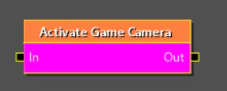

Активирует главную игровую камеру. Этот блок пригодится, если ранее вы установили статическую камеру (например так, чтобы камера смотрела на игрока спереди в каком то месте игры). Блок позволит вернут камеру за спину игрока в стандартное положение.

* **blendTime** - указывает время за которое произоидет переход от другой камеры. 0, если хотите, чтобы установка произошла моментально.

### Run Static Camera

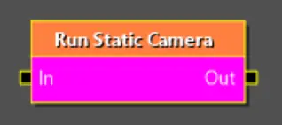

Активирует статическую камеру, заранее установленную в игровом мире.

* **cameraTag** - тег камеры, которую вы хотите активировать.

### Static Camera Sequence

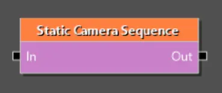

Создает последовательные переходы между статическими камерами, установленными в мире.

* **cameras** - массив тегов нужных камер
* **maxWaitTimePerCamera** - максимальное время ожидания перед переходом к следующей камере.

### Switch Static Camera

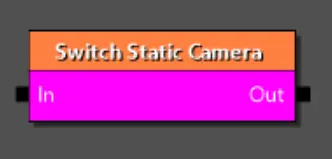

Используется для плавного переключения между двумя статическими камерами, присутствующими в мире (первая камера уже должна быть активирована перед вызовом этого блока).

* **nextCameraTag** - тег камеры, к которой должен произойти плавный переход.

## Complexity management (Управление сложностью)

### Start/In

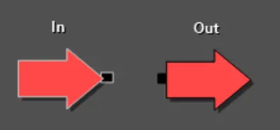

Отвечает за вход в квест/фазу. Блок **Start** используется в квесте и определяет начало квеста. Блок **In** используется в фазе и является точкой входа в фазу. У фазы может быть более одного блока **In** для реализации разных логик входа в фазу уровнем выше (для этого у каждого **In** нужно задать свойство **socketID**).

### End/Out

Отвечает за прекращение работы квеста/фазы. Блок **End** используется в контексте квеста и знаменует полное завершение всех действий внутри заданного квеста. Блок **Out** используется в фазах и полностью завершает выполнение всех логик внутри фазы.

### Phase

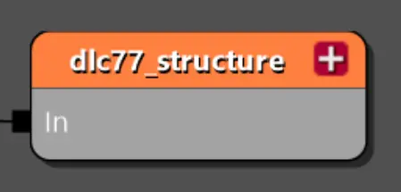

Фаза - это, по сути, папка, используемая для структурирования квеста. Технически они не обязательны, но рекомендуется добавить их для лучшей структуры. Они также могут иметь собственный внешний **w2phase** или быть встроенным в родительский файл.

* **phase** - Ссылка на файл **w2phase**. Может быть оставлена пустой и, в таком случае она будет встроена в родительскую систему.
* **requiredWorld** — ждёт, пока игрок окажется в нужном мире, чтобы начать сигнал. Необязательное свойство. Удобно если вы хотите, чтобы какая то часть сюжета запустилась при попадании игрока в нужны мир и при этом избавляет от необходимости заводить под это отдельный факт.
* **isBlackscreenPhase** — сохраняет чёрный экран до завершения фазы и достижения сигнала выхода. Используется для очистки контента после сцены или квеста, чтобы игрок его не видел (например, при исчезновении NPC или для прятания некоторых реквизитов).
* **blackscreenFadeDuration** — как быстро черный экран появляется/исчезает.
* **saveMode** — определяет, может ли игрок сохранить игру, пока сигнал находится внутри этой фазы. Удобно, если вы хотите создать какие то ситуации, которые не дают сохранить игру до их окончания.
* **soundsBanksDependency** — Выбирайте, какие саундбанки принудительно загружать, когда эта фаза активна.
* **playGoChunk** — выбирает, какой фрагмент контента загрузить для фазы. Chunk (чанки) - это заранее заготовленные наборы игровых ресурсов, которые можно загрузить при входе в фазу, что обеспечит правильную работоспособность логик внутри фазы (например если требуется, чтобы прогрузился некий NPC). Это свойство связано с настройками requiredWorld и soundsBanksDependency, которые вместе обеспечивают корректную подготовку всех ресурсов для фазы.

## Flow control (Управление потоком)

### Condition

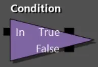

Проверяет, является ли конкретное условие в данный момент **True** или **False**, и немедленно выпускает сигнал через  соответствующий выход.

* **questCondition** - условие, которое нужно проверить. На выбор предоставляется множество готовых условий, каждое из которых имеет собственные настройки. Основной набор условий и примеры их использования приведены на отдельной [странице](conditions_and_functions.md/#_2).

### Cut Control

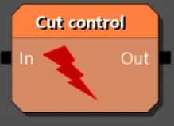

Используется, чтобы завершить ожидание, действие или целую фазу по сценарному условию, не дожидаясь, пока будут выполнены исходные условия этих узлов. Это похоже на выключение света в комнате, не заходя в неё. Как пример использования - ограничение времени на решение задачи (например, "найди улику за 60 секунд"). Вместо того чтобы создавать сложную систему отсчёта, вы можете использовать **Pause** и деактивировать реакцию на улику через **Cut Control** по истечении времени прервав всю логику работы с найденной уликой.

* **permanent** - ключевое свойство, определяющее возможность повторной активации узла. **False** - связанный узел теряет только текущий сигнал. Если позже новый луч войдёт в этот узел, он активируется как обычно. **True** - связанный узел навсегда отключается. Любой последующий луч, входящий в него, будет проигнорирован

### Pause

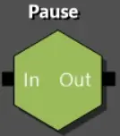

Один из самых важных узлов в графе квестов. Удерживает сигнал внутри, пока не будет выполнено заданное условие. После выполнения условий сигнал выходит из выхода.

* **conditions** - список условий, который должны выполнится, прежде чем пауза будет снята (должны быть выполнены все условия). На выбор предоставляется множество готовых условий, каждое из которых имеет собственные настройки. Основной набор условий и примеры их использования приведены на отдельной [странице](conditions_and_functions.md/#_2).

### Random

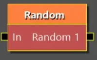

Выпускает луч в произвольную выходную точку. Этот блок поможет при необходимости сгенерировать случайное действие. Например вы хотите, чтобы при посещении какой то локации погода сменилась на случайную. Присоединив к выходным точкам скрипты смены погоды, луч попадет в случайный.

* **++пкм++ на блок + "Add output"** - добавить еще одну выходную точку
* **++пкм++ на блок + "Add termination input"** - добавить входящую точку которая прекращает работу блока. Пригодится если при каком то условии луч попавший в блок, не должен уйти дальше.

## Game systems control (Управление игровыми системами)

### Change World

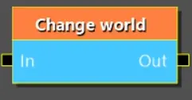

Переносит игрока в указанный игровой мир.

* **worldFilePath** - путь к файлу мира w2w. Не рекомендуется указывать. Вместо этого выберите обозначение мира в следующем свойстве.
* **newWorld** - внутреннее обозначение мира, в который нужно переместить игрока.
!!! warning "Важно!"
    Если ваш мод включает новый мир, то его необходимо добить как [DLC-мод](../../base/dlc/index.md). Имя вашего мира для данного списка можно будет задать в [маунтере](../dlc/dlc_mounters.md) **CR4WorldDLCMounter** вашего [DLC Definition](../dlc/dlc_definition.md). Формат имени **"AN_MyWorldName"**.
* **loadingMovieName** - Видео, которе нужно проиграть перед загрузкой мира (путь к файлу формата [.usm](../../guides/create_usm_video.md)). Используйте, если это первое посещение мира и вы хотите показать какое то вступительное видео.
* **targetTag** - тэг точки на карте, куда будет телепортирован игрок при смене мира.

### Checkpoint

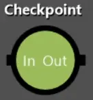

Сохраняет игру. Нужен, чтобы в важных сюжетных точках позаботится о сохранении и не откатывать игрока далеко назад в случае чего.

* **enableSaving** - можно использовать как запрет на сохранение, если поставить **False (красный крестик)**. Запрет на сохранение останется до следующего места, где он будет разрешен. Аналог этой операции есть в скриптах, поэтому **текущее свойство рекомендуется всегда использовать со значением True (зеленая галочка)**.
* **ignoreSaveLocks** - сохранит игру игнорируя любы запреты на сохранение (если таковые были заданы ранее). Используйте только в очень важных местах сюжета.

### Denied Area

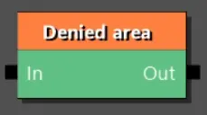

Включает/отключает запрещающую зону на карте мира. Нужно, если у вас установлена зона которая запрещает доступ NPC и вы хотите в процессе отключить ее работу.

* **entityTag** - тэг запрещающей зоны на карте.
* **enabled** - работает ли запрещающая зона. **True (зеленая галочка)**, если зона активна и NPC не могут ее посещать. **False (красный крестик)**, чтобы выключить зону и сделать ее доступной для NPC.

### FactsDB Change

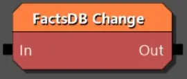

Важнейший блок, позволяющий управлять [фактами](general.md/#_6) игры.

* **factID** - текстовый идентификатор факта.
* **value** - значение которое нужно задать или прибавить к факту.
* **setExactValue** - **True (зеленая галочка)**, если вы хотите, чтобы было установлено то значение, что задано в **value**. **False (красный крестик)**, чтобы прибавить к текущему значению факта значение из **value** (отрицательные значения тоже работают).

### Hide/Show layers

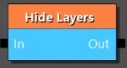

Используется для отображения и скрытия слоев в мире. У этого есть две основные цели: показать изменения в мире, зависящие от действий игрока / времени, и оптимизировать игру, чтобы не загружать слишком много квестовых объектов, когда они не нужны.

* **world** - В каком мире показывать/скрывать слой. Если не указать, то поиск слоя будет происходить в текущем мире (в том в котором игрок, на момент вызова блока).
* **layersToShow** - список слоев для отображения.
* **layersToHide** - список слоев для скрытия.
* **syncOperation** - если установлено значение **False**, слои отображаются/скрываются асинхронно (это означает, что может быть небольшая задержка в изменении состоянии слоев). Если установлено значение **True**, изменение происходит в одном и том же кадре (что может привести к снижению производительности, в зависимости от количества объектов в слоях). Для достижения наилучшей производительности старайтесь скрывать/показывать слои до загрузки мира с указанием **False**. Если же необходимо изменить видимость слоев этом мире, то стройте вашу логику так, чтобы игрок был на расстоянии и также используйте **False**. Значение **True** используйте в сценариях где вам по задумке нужно что-то показать или скрыть прямо перед игроком.

### Manage Fast Travel

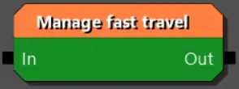

Управление точками быстрого перемещения. Позволяет сделать столбы для перемещения активными/не активными, а также видимыми/скрытыми на карте. Например Каэр Морхен виден на карте, но вы не сможете в него попасть, пока не будет активирован/отображен столб для быстрого перемещения.

* **operation** - выберите что делать с точками быстрого перемещения. Существует три варианта: управление активностью и видимостью (*QMFT_EnableAndShow*), управление только активностью (*QMFT_EnableOnly*) и управление только видимостью (*QMFT_ShowOnly*).
* **enable** - **False (красный крестик)** для деактивации точки быстрого перемещения. **True (зеленая галочка)** - для активации точки быстрого перемещения. Влияет на то, сможет ли игрок использовать точку, подойдя к ней. Это свойство не сработает если в **operation** выбрано управление видимостью (*QMFT_ShowOnly*).
* **show** - **False (красный крестик)** для скрытия точки быстрого перемещения. **True (зеленая галочка)** - для показа точки быстрого перемещения. Влияет на то, видна ли точка на карте. Это свойство не сработает если в **operation** выбрано управление активностью (*QMFT_EnableOnly*).
* **affectedAreas** - коллекция миров в которых мы управляем точками быстрого перемещения.
* **affetedFastTravelPoints**- список тэгов, тех точек быстрого перемещения, на которые влияет операция.

### Manage Switch

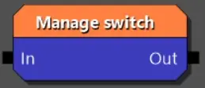

Управляет переключателями в игре. Этот блок позволяет управлять различными интерактивными объектами в игре, которые имеют состояния (например рычаги или двери).

* **switchTag** - тег переключателя в мире.
* **operations** - коллекция операций, которые нудно применить к переключателю. Например вы хотите закрыть и заблокировать дверь (две операции).
* **force** - **False (красный крестик)** проигнорирует операцию, если состояние невыполнимо или уже то, что мы пытаемся сделать. **True (зеленая галочка)** - если мы принудительно вводим переключатель в указанное состояние.
* **skipEvents** - **True (зеленая галочка)** - чтобы пропустить все события, которые привязаны к действию переключателя. Например некоторые объекты на уровне шаблона имеют сопутствующие события, происходящие при переключении. Это свойство позволит их проигнорировать.

### Minigame

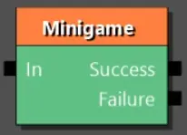

Запускает мини-игру (Гвинт или кулачный бой).

* **minigame** - выберите из списка вариант мини-игры

Кулачный бой:

* **fightAreaTag** - тэг области в которой находится игрок и его соперники.
* **playerPosTag** - тэг точки в которой находится игрок в начале боя (будет телепортирован в эту точку).
* **toTheDeath** - **True (зеленая галочка)** если хотите чтобы бой продолжался смерти (игрока или всех соперников). **False (красный крестик)** и тогда бой закончится при низком здоровье игрока (или всех участников).
* **endsWithBlackscreen** - **True (зеленая галочка)** если в конце мини-игры нужно увести экран в затемнение. Используйте, если сразу после вы планируете показывать сцену, где будет выход из затемнения.
* **enemies** - коллекция врагов, участвующих в схватке. Каждый элемент состоит из двух свойств: *npcTag* - тэг противника, *startingPosTag* - тэг точки на которой он появляется в бою.

Гвинт:

* **deckName** - название колоды, которую будет использовать враг.
* **difficulty** - уровень сложности противника.
* **aggression** - стратегия игрока противника. Варьируется от оборонительной до очень агрессивной.
* **allowMultipleMatches** - **True (зеленая галочка)** разрешает несколько партий подряд (матч-реванш).
* **forceFaction** - применяется для выбора колоды которой сыграет игрок. Например, если вы проводите турнир, где игроки поочереди играют разными колодами фракций. *GwintFaction_Neutral* - оставит колоду игрока.

### Time Management

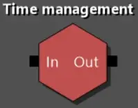

Позволяет управлять временем в игре.

**CPauseTimeFunction** - ставит время на паузу или возобновляет его. Удобно для больших сюжетных моментов в которых важно сохранить текущее время игры.

* **pause** - **True (зеленая галочка)**, чтобы поставить время на паузу. **False (красный крестик)**, чтобы возобновить время.

**CSetTimeFunction** - установить игровое время на конкретное значение.

* **newTime** - устанавливает указанное игровое время
* **callEvents** - отправляет события связанные со временем. Например, если есть какая то реакция на смену дня и ночи, то событие будет сгенерировано и пнет эту реакцию.

**CShiftTimeFunction** - сдвигает игровое время на указанное значение.

* **timeShift** - на сколько часов, минут, секунд изменить время.
* **callEvents** - отправляет события связанные со временем. Например, если есть какая то реакция на смену дня и ночи, то событие будет сгенерировано и пнет эту реакцию.

## Gameplay (Игровой процесс)

### Encounter full respawn

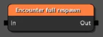

Используется для полного перезапуска столкновения (*Encounter*). Основная идея — сбросить его до исходного состояния. Например, если игрок убил всех противников в зоне, вы можете использовать этот блок, чтобы все враги снова появились при выполнении определенных условий.

* **encounterTag** - тэг зоны столкновения (*Encounter Area*) на карте.

### Encounter manager

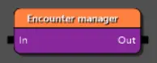

Используется для контроля встреч (*Encounters*) напрямую из логики квеста. Пригодится, когда вам нужно динамически включать, отключать встречу или управлять её фазами в процессе выполнения квеста.

* **encounterTag** - тэг зоны столкновения (*Encounter Area*) на карте.
* **enableEncounter** - включение или выключение встречи. Устанавливает, будет ли встреча активна при выполнении этого блока квеста. Если **False (красный крестик)**, встреча не начнется.
* **forceDespawnDetached** - принудительная выгрузка открепленных существ. Если установлено в **True (зеленая галочка)**, блок принудительно удалит всех NPC, которые были «откреплены» от встречи. Обычно это происходит, когда существо начинает преследовать игрока за пределами области встречи (**Encounter Area**). Полезно для «очистки» мира после завершения квеста.
* **encounterSpawnPhase** - запуск с определенной фазы. Позволяет запустить встречу не с ее фазы по умолчанию (*Default Phase*), а сразу с другой фазы, заданной в графе встречи (*Encounter Graph*) . Если указано **"None"**, будет использована фаза по умолчанию.

### Encounter manual activation

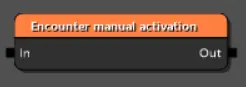

Отдельный блок, позволяющий запустить или прекратить столкновение (*Encounter*)

* **encounterTag** - тэг зоны столкновения (*Encounter Area*) на карте.
* **deactivateEncounter** - **False (красный крестик)**, чтобы активировать (запустить) столкновение. **True (зеленая галочка)** для деактивации.

### Encounter phase setter

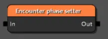

Позволяет указать конкретную фазу для встречи (столкновения).

* **encounterTag** - тэг зоны столкновения (*Encounter Area*) на карте.
* **encounterSpawnPhase** - выбор определенной фазы. Позволяет выбрать фазу из графа встреч (*Encounter Graph*). Если указано **"None"**, будет использована фаза по умолчанию.

### Entity Motion

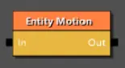

Это блок интерполяции (плавного перехода) состояния сущности. Её основная задача — не просто переместить предмет из точки A в точку B, а плавно и контролируемо изменить его позицию, поворот (вращение) и/или масштаб в пространстве за заданное время, следуя определённой кривой анимации. На практике это позволяет реализовать разные эффекты, как например, парящий предмет, или плавный сдвиг камня, заслонявшего пещеру.

* **entityTag** - тэг сущности для которой применяется перемещение.
* **duration** - длительность анимации перемещения в секундах.
* **targetTransform** - начальные координаты сущности. Можно не указывать, если сущность уже расположена в мире на нужных координатах.
* **positionDelta** - смещение позиции сущности.
* **rotationDelta** - поворот сущности.
* **scaleDelta** - изменение масштаба сущности (увеличение или уменьшение).
* **animationCurve** - кривая анимации. Позволяет управлять поведением анимации, например более быстрая в начале и медленная в конце.

### Fast forward communities

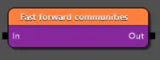

Этот блок предназначен для тонкого контроля над процессом "перемотки" NPC, чтобы избежать багов и неестественного поведения. Так как у NPC размещенных с помощью *Community* есть различные расписания и сценарии поведения, могут возникнуть ситуации когда потребуется быстро привести поведение NPC к текущему времени суток. Этот блок поможет привести NPC  к тому состоянии, которому они должны соответствовать в текущий игровой момент.

* **manageBlackscreen** - **True (зеленая галочка)**, чтобы процесс "перемотки" быс скрыт за черным экраном. Обязательно ставьте True, если игрок находится радом с NPC, для которых применяется блок.
* **respawnEveryone** - принудительный респаун всех NPC. Если **True (зеленая галочка)**, узел полностью удалит и заново создаст всех NPC, сбросив их состояние. Рекомендуется использовать только в крайних сценариях.
* **dontSpawnHostilesClose** - **True (зеленая галочка)**, чтобы враждебные NPC не появились рядом с игроком. Этот пункт поможет избежать ситуаций, когда из-за "перемотки" при выходе из затемнения на игрока сразу нападут враги.
* **timeLimit** - лимит времени, на которое игра можете перемотать NPC. Если указано **-1**, то перемотка не имеет ограничений и NPC будут приведены к текущему игровому времени. А, например, значение 3600 переметет NPC всего на игровой час вперед.

### Interest point emitter

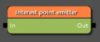

Вероятно устаревший блок. В игре не разу не используется. Вероятно заменой этого блока стал блок представленный ниже.

### Look at

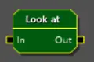

Позволяет управлять вниманием (взглядом) различных NPC. Применяется в активных сценах (когда диалог между персонажами происходит в процессе игры). Например, вы исследуете помещение, пока NPC что-то рассказывает вам. Данный блок позволит сделать так, чтобы NPC следил за вами взглядом (поворачивая голову или даже все тело).

* **actor** - тэг NPC, который будет следить взглядом.
* **target** - тэг персонажа, за которым нужно следить взглядом. Чаще всего это игрок (*PLAYER*), но можно указать и другого NPC для более сложных взаимодействий.
* **enabled** - **True (зеленая галочка)** для активации процесса отслеживания или **False (красный крестик)** для прекращения.
* **type** - тип отслеживания. Например, еси нужно зафиксировать взгляд на одной точке, или чтобы он динамически следил за целью.
* **duration** - продолжительность отслеживания в секундах. Например NPC смотрит на игрока 5 секунд. пока звучит его реплика, а после продолжает идти по своим делам.
* **canCloseEyes** - разрешено ли закрывать глаза. Для живых персонажей (при высоких **duration**) используйте **True (зеленая галочка)**, чтобы избежать эффекта куклы.
* **forceCloseEyes** - принудительно закрыть глаза. Глаза будут закрыты до конца действия блока.
* **speed** - коэффициент скорости для поворота головы/тела. 0 - стандартная скорость.
* **level** - уровень отслеживания. От простого слежения глазами, до полного поворота тела в сторону **target**.
* **range** - дистанция на которой действует отслеживание (в метрах). Если объект выйдет за приделы дистанции, то блок прекратит работу. 0 - без ограничений по дистанции.
* **gameplayRange** - то же самое, что предыдущий пункт, но с учетом влияния на поведение игры и внутреннюю логику. Обычно оба этих свойства имеют одинаковое значение.
* **limitDeact** - ограничить деактивацию. Используйте, чтобы отслеживание не было деактивировано другими алгоритмами игры.
* **instant** - позволяет мгновенно перевести взгляд (повернуть тело/голову) на цель. Используйте с осторожностью, если уверены, что игрок это не увидит.
* **staticPoint** - координаты статической точки на которой сосредоточен взгляд. Работает только в связке *DLT_StaticPoint* для **type**.
* **headRotationRatio** - разрешенный поворот головы (в градусах). Для **level** со значением *LL_Head* не имеет смысла (ставить 0), однако для **LL_Body** это значение позволяет отвязать поворот головы от поворота тела, делая слежение более естественным. Для второго случая используйте значение в от 50 до 150 градусов (наиболее естественный угол отклонения).
* **eyesLookAtConvergenceWeight** - кооэффициэнт сведение взгляда. Делает взгляд более естественным на разных дистанциях.
* **eyesLookAtIsAdditive** - указывает, что анимация слежения должна сливаться с текущей анимацией. Делает анимацию более естественной и плавной, но пренебрегает некоторыми значениями заданными выше.
* **eyesLookAtDampScale** - корректирует естественность поворота глаз. Довольно редкий сценарий использования. Например если нужно создать эффект пьяных глаз.

### Play animation

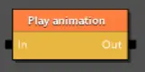

Проигрывает анимацию для указанной сущности в мире (например мост, дверь или рычаг).

* **entityTag** - тэг сущности для которой проигрывается анимация.
* **animationName** - имя анимации. Это имя должно быть определено среди пакетов анимаций, подключенных к сущности.
* **operation** - операция с анимацией (воспроизведение, пауза или остановка).
* **playCount** - количество повторений анимации.
* **playLengthScale** - множитель скорости. 1 — нормальная скорость. 0.5 — вдвое медленнее, 2.0 — вдвое быстрее. Полезно для создания различных эффектов (например медленное открытие тяжелой двери).
* **playPropertyCurveMode** - направление анимации (с начала в конец или с конца в начало).
* **rewindTime** - время которое нужно пропустить в начале анимации (чтобы воспроизвести ее, например с середины).

### Reward

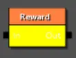

Вручает игроку указанную награду (например по итогам выполнения квеста). Теоретически может использоваться для вручения награды другим персонажам, но механика игры построена так, что этот блок практически всегда используется для вручения награды игроку.

* **rewardName**-  имя награды (определено в файлах игры или DLC).
* **targetEntityTag** - тэг персонажа, которому вручается награда. Практически всегда *PLAYER*.

### Spawn Not Streamed Boat

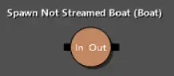

Вероятно устаревший блок либо остаток от нереализованной системы лодочных гонок. В игре ни разу не использовался.

### Spawn Player's Vehicle

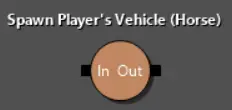

Позволяет заспавнить (загрузить) средство передвижения в указанной точке. Например когда вы входите в усадьбу Корво Бьянко, этот блок загрузит лошадь в конюшне. Либо если вы уплыли с острова на лодке, а затем снова переместились на этот остров, можно снова подгрузить лодку к причалу.

* **vehicleType** -  тип средства передвижения (лошадь или лодка).
* **spawnPointTag** - тэг точки в мире, куда нужно заспавнить средство передвижения.

### Story phase setter

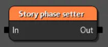

Управляет активацией/деактивацией определенных фаз взаимодействия с NPC (*Community*). Важный блок для организации сюжетных изменений для NPC.

* **spawnsets** - коллекция действий, варианты которых определены ниже.

**CActivateStoryPhase** - активировать фазу.

* **spawnset** - путь к файлу *Community* (**.w2comm**), который содержит NPC.
* **phase** - имя фазы, которую нужно активировать.
* **streamingPartition** - настройка для продвинутых пользователей. Оставьте пустым.

**CDeactivateSpawnset** - деактивировать *Community*.

* **spawnset** - путь к файлу *Community* (**.w2comm**), который необходимо деактивировать (NPC будет выгружен из игры).

## Helper tools (Вспомогательные инструменты)

!!! info "Примечание"
    Блоки из этого раздела не влияют на игру и ее механики. Данные блоки используются сугубо для комментирования и обозначения блоков и предназначены для внутренней работы с графом квестов.

### Comment block

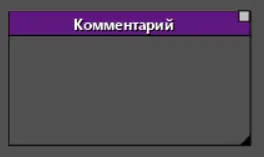

Позволяет обернуть группу блоков, указав общий комментарий. Применяется для внутреннего обозначения, например при совместной работе, чтобы другой разработчик понял логику либо выполнил доработки из комментария.

* **commentGraphBlockText** - текст комментария, которые будет отображаться в заголовке блока.
* **titleColor** - цвет заголовка в блоке.

### Description note

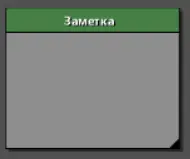

Блок заметка, который можно разместить в любом месте редактора. Поможет не забыть какую то логику или будущие доработки.

* **caption** - заголовок блока.
* **descriptionText** - текст внутри блока, который и будет вашей заметкой.

## Journal (Журнал)

### Entry

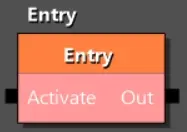

Активирует запись в журнале.

* **entry** - ссылка за запись в журнале.
* **showInfoOnScreen** - **True (зеленая галочка)**, если хотите, чтобы информация об активации записи журнала была показана на экране.

### Map Pin State

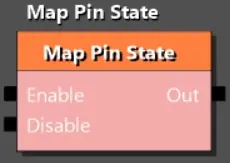

Управляет точками на карте, которые связаны с записью журнала. Обычно при активации задания в журнале, на карте обозначается некоторая точка (или радиус) что связаны с этим заданием. Некоторых логиках вам может потребоваться не сразу показывать эти точки или скрывать их при каких то условиях. Например игрок идет по следу из улик и вам нужно активировать (показать) следующую улику на карте, только после того как игрок найдет предыдущую.

* **mappinEntry** - ссылка на элемент журнала, связанного с этой точкой на карте.
* **enableOnlyIfLatest** - значок станет видимым только если он является последним (самым новым) в цепочке связанных значков для текущей цели. Как раз применяется для системы последовательной активации точек при их нахождении игроком.
* **disableAllOtherMapPins** - если **True (зеленая галочка)**, при активации этого значка все остальные значки в рамках одного задания будут автоматически отключены. Так же позволяет реализовывать последовательное перемещение по точкам, при этом убирая уже пройденные.

### Objective Counter

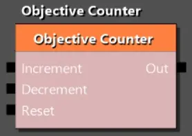

Используется для отслеживания выполнения количественных задач, управляя счётчиком у конкретной цели в журнале. Например, если по заданию нужно убить три волка, вы можете после убийства волка увеличивать счетчик в задании с помощью этого блока.

* **manualObjective** - указывает на запись в журнале (objective), счётчик которой нужно изменить.
* **showInfoOnScreen** -  **True (зеленая галочка)**, если хотите, чтобы информация об изменении счетчика была показана на экране.

Блок имеет три входящих точки:

* **Increment** - увеличивает значение счётчика на 1.
* **Decrement** - уменьшает значение счётчика на 1.
* **Reset** - сбрасывает значение счётчика в 0. Пригодится, если по заданию нужно убить три волка за определенное время. Если игрок не вложился, счетчик будет сброшен.

### Quest

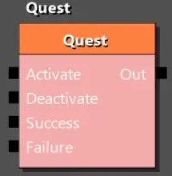

Основной способ работы с журналом заданий. С помощью этого блока вы чаще всего будете управлять заданиями в журнале, переводя их в различные состояния.

* **questEntry** - ссылка на задание в журнале.
* **showInfoOnScreen** - **True (зеленая галочка)**, если хотите, чтобы информация об изменении состояния задания была показана на экране.
* **track** - **True (зеленая галочка)**, если хотите, чтобы это задание стало отслеживаемым (текущим основным для игрока).
* **enableAutoSave** - стоит ли делать автосохранение после изменения состояния журнала.

### Quest Monster Known

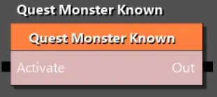

Предназначена для заполнения бестиария новой записью.

* **manualQuest** - ссылка на запись журнала, которая связана с записью в бестиарии.

### Track Quest

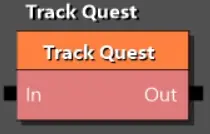

Позволяет направить внимание игрока на конкретный этап задания.

* **questEntry** - ссылка на задание в журнале.
* **objectiveEntry** - ссылка на конкретную цель (этап) в рамках указанного задания.

## Logical (Логические)

### And

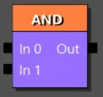

Пропустит луч дальше, если сигнал пришел во все входящие точки. ++пкм++ на блок, чтобы добавить еще входящих точек. Применяется, если для продвижения по квесту, обязательно исполнения нескольких условий.

### Xor

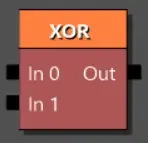

Единожды пропустит луч, если сигнал прошел через любую входящую точку. Все остальные входящие сигналы будут игнорироваться. Применяется, если нужно активировать событие по одному из нескольких вариантов. Например вы нашли улику или смогли разговорить крестьянина. Событие будет запущено, а срабатывание других условий проигнорировано.

## PlayGo

### Activate Content

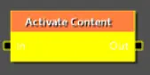

Заранее активирует фрагмент игрового контента. Этот блок выполняет задачу по оптимизации игры.

* **playGoChunk** - сhunk (чанки) это заранее заготовленные наборы игровых ресурсов, которые можно загрузить в нужный момент, что позволит избежать прогрузки контента на глазах у игрока.

## Scenes (Сцены)

### Context Dialog

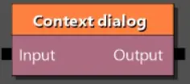

Встраивает одну сцену в другую. Это блок позволяет дополнить существующую сцену новым диалогом. очень удобно, если вы делаете DLC и ходите внедрить в имеющийся игровой диалог новые варианты взаимодействий.

* **scene** - путь к файлу сцены, которую нужно встроить.
* **targetScene** - путь к файлу с целевой сценой, в которую мы встраиваем свою.

### Interaction Dialog

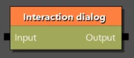

Добавляет для указанного NPC интеракитный диалог. Это позволяет подойти к NPC и начать с ним диалог, настроенный этим блоком.

* **scene** - ссылка на файл сцены.
* **actorTags** - тэг NPC с которым активируется интеракитный диалог.
* **interrupt** - **True (зеленая галочка)**, чтобы при начале интеракитного диалога прервать предыдущие взаимодействия.

### Scene

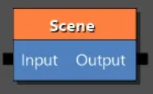

Запускает указанную сцену (катсцену).

* **scene** - ссылка на файл сцены.
* **forcingMode** - режим принудительной активации. Поможет убедится, что все необходимое для сцены, будет присутствовать на уровне.
* **interrupt** - **True (зеленая галочка)**, если сцену может прервать игрок или игровое событие (например нападение монстра).
* **shouldFadeOnLoading** - **True (зеленая галочка)**, если хотите чтобы перед запуском сцены экран ушел в затемнение. При таком значении вы должны позаботится о выходе из затемнения внутри сцены.
* **playGoChunk** - сhunk (чанки) это заранее заготовленные наборы игровых ресурсов, которые можно загрузить в нужный момент, что позволит избежать прогрузки контента на глазах у игрока.

### Scene prepare

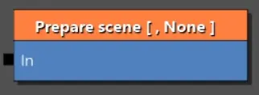

Подготавливает сцену для ее вопроизведения. Это позволяет загрузить нужные ресурсы в память заранее и избежать подвисания в начале воспроизведения тяжелой сцены.

Содержит коллекцию сцен, которые нужно подготовить (**storyScenes**):

* **scene** - ссылка на файл сцены.
* **input** - имя входящей точки по которой пойдет путь сцены. Если не указано, в память будет загружена вся сцена.

### Scripted Dialog

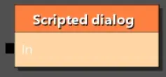

Вероятно устаревший блок. Не используется в основной игре.

## Scripting (Скрипты)

!!! warning "Важно!"
    Практически все блоки в этом разделе позволяют точечно управлять игровыми скриптами. Это сложные механики требующие отдельных статей на каждый такой блок, поэтому они не будут тут рассмотрены (кроме одного, см ниже).

### Script

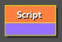

Это очень важный блок, который позволяет выполнить игровой скрипт. Огромное число операций в игре выполняется через скрипты, не говоря о том, что вы можете сами их написать. Согласно логике работы блока, вам нужно выбрать один из множества скриптов списке и после появятся дополнительные поля для настройки. Так как это важная часть создания квестов, часть существующих скриптов описаны вы [этой](conditions_and_functions.md/#_3) статье.

* **functionName** - имя функции из большого списка. Если вы написали свою функцию, она так тут появится.
* **saveMode** - режим участия этого скрипта в сохранении. **QSCSM_SaveBlocker** - не позволит сохранить игру, пока скрипт не закончится. **QSCSM_Restart** - даст сохранить игру, но при загрузке сохранения, этот блок выполнится заново.

***
Автор: lxgdark

*Документация поддерживается участниками сообщества [REDkit RU](https://discord.gg/kRTEy8KcNa)*
***
