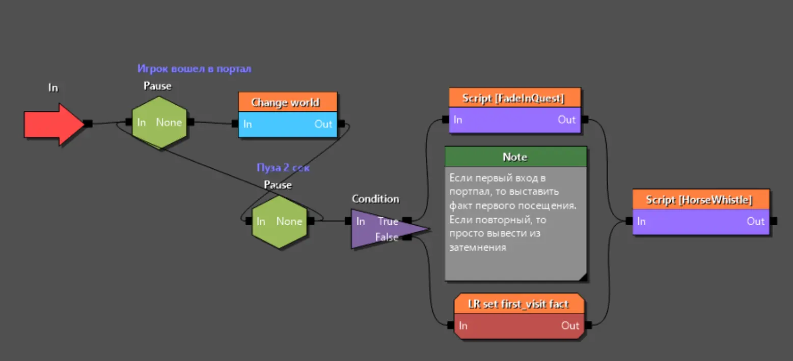

---
tags:
  - quest
  - sample
  - example
  - основы
  - w2quest
  - w2phase
  
status: new
---

# Примеры игровых сценариев внутри файла квеста

## Взаимоисключающие сюжетные линии

Если по вашему замыслу в вашем сюжете есть несколько линий повествования, которые взаимоисключают друг друга, вы можете столкнутся со сложностями составления структуры блоков. Вероятнее всего каждая из линий будет запущена в зависимости от срабатывания триггера или установки некоторого факта и, в структуре блоков у вас будет блок [ожидания](general.md/#_5), который пропустит [луч](general.md/#_4) после выполнения условий.

Однако проблема возникает из-за того, что после срабатывания условия для одной сюжетной ветви, вам нужно позаботится о том, чтобы исключить срабатывание других. Одно из решений, введение дополнительного [факта](general.md/#_6) для контроля отработки других условий. Установив такой факт при срабатывании одной из веток, вы проверяете его во всех остальных и не допускаете их выполнения.

Впрочем есть более изящное решение, которое одновременно и более верное. Дело тут в важной особенности работы [фаз](general.md/#_3). Суть в том, что когда луч достигает блока **Out** внутри фазы, вся фаза прекращает свою работу и считается завершенной. Если внутри файла фазы были ожидания или циклы, они прервутся и более никогда не выполнятся. Это значит. что мы можем разбить наши взаимоисключающие ветви сюжета на файлы фаз (что верно с точки зрения структуры) и внутри каждого организовать следующее ветвление:

* Первая ветвь отвечает за проверку факта, отвечающая за эту часть сюжета, а затем реализует все действия в рамках этого сюжета.
* Вторая ветвь внутри нашей фазы, проверяет срабатывание фактов в других фазах с взаимоисключающими ветками и, если таковой факт появится, ведет луч к блоку **Out**.

Таким образом стоит сработать хотя бы одному факту в наших линиях сюжета, как все остальные фазы завершатся и больше никогда не сработают.

## Циклические структуры

Циклические структуры довольно частый сценарий при создании квестов. Любая повторяющаяся логика или (диалог) должны реализовывать циклическую структуру, поэтому важно понимать как они работают.

Рассмотрим пример такой структуры. Предположим, что у нас есть портал, который переносит игрока в другой игровой мир. Нам важно, чтобы когда игрок вернется из того мира и снова пройдет через портал, все отработало так же как и до этого, а значит мы имеем классический пример цикличной структуры.

На скриншоте показана итоговая реализация нашего пример, которую мы разберем поэтапно.
!!! info "Примечание"
    В данном примере логика работа портала выведена в отдельный фал фазы, что является правильным походом. Запустив луч в том месте фазы, что вам нужно, она остается работоспособной на протяжении всей оставшейся игры и выполняет логику, вне зависимости от состояния других частей квеста.

Логика фазы с циклом:

* Когда игрок входит в портал будет установлен соответствующий факт (это настраивается в свойствах портала при его размещении в мире)
* Первый блок в нашей фазе это блок ожидания срабатывания нужного факта. В нашем случае блок ждет, пока будет установлен факт портала.
* Следующий блок переносит игра в указанный мир
* Затем путь ведет к блоку паузы на несколько секунд. Это нужно, так как луч проходит по блокам очень быстро и в случае циклических логик есть опасность двойного срабатывания. **Всегда используйте паузы в циклических сценариях**.
* От блока пазу мы возвращаем луч к первоначальному блоку ожидающему факт от портала. Таким образом, если игрок снова пройдет через портал, цил повторится.

По сути все вышеописанное уже закрывает нашу задачу (почти), но у нас есть некоторые доработки.

* Пауза цикла, помимо возврата в начало цикла, направляет луч на блок проверки. В этом блоке мы проверяем посещал ли игрок от мир ранее. В это примере, если игрок посещает мир мода впервые, срабатывает катсцена.
* В случае, если игрок впервые посещает мир мода, устанавливается соответствующий факт, на который будет реакция в другом файле фазы, что вызовет воспроизведение катсцены.
* Если игрок уже был в этом мире, вызывается скрипт **"FadeInQuest"**, который выводит экран из затемнения (экран затемняется во внутреннем коде работы портала). Как вы можете заметить из затемнения экран выводится, только в случае повторных посещений. Дело в том, что при первом посещении эту задачу выполняет катсцена.
* В конце (сугубо для примера) выполняется скрипт вызова лошади. К этому скрипту ведут оба блока, что гарантирует его срабатывание при любом условии.

По итогу мы имеем повторяющийся сценарий, где в один момент луч раздваивается и одна его часть возвращается в начало, а вторая выполняет сопутствующие действия.

!!! info "Примечание"
    Обратите внимание, что в примере нет блока **Out**, так как переход к этому блоку завершает фазу и прекращает любые ожидания внутри, что остановит работу нашего цикла.

***
Автор: lxgdark

*Документация поддерживается участниками сообщества [REDkit RU](https://discord.gg/kRTEy8KcNa)*
***
